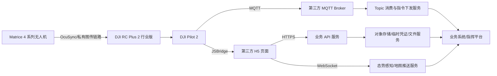
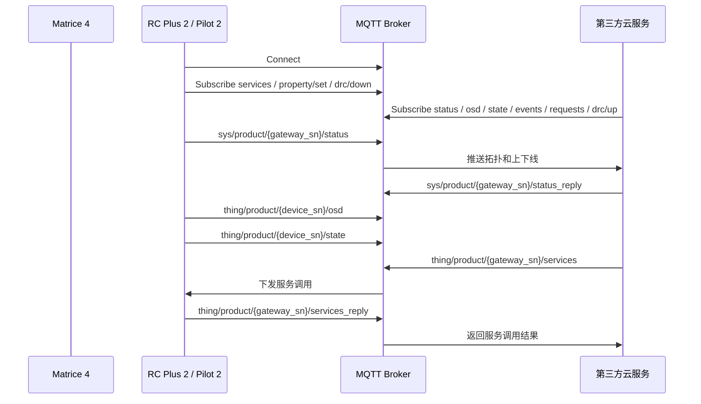
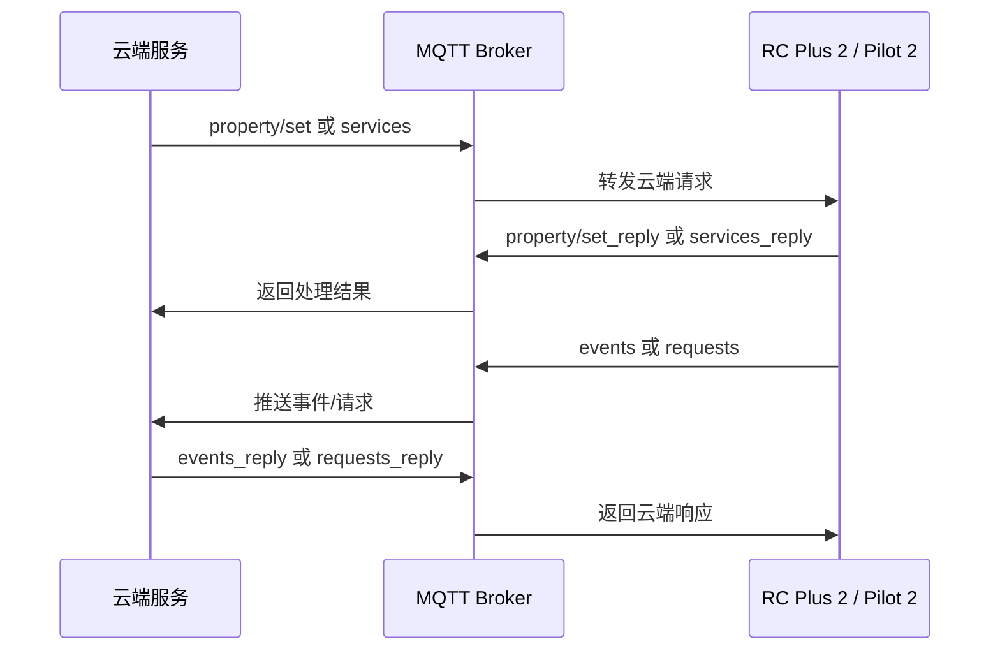
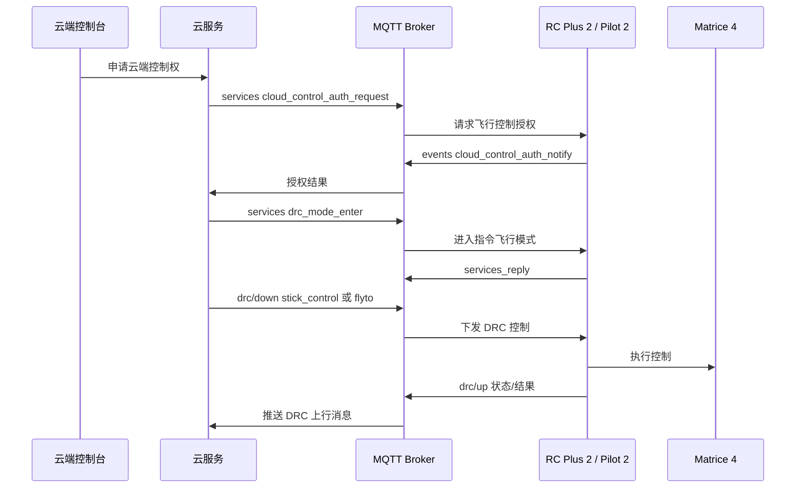

# DJI 大疆无人机 Pilot 上云 API 接入实施文档

## 一、概述

本文面向技术负责人、后端开发和无人机业务系统集成方，说明在 DJI Pilot 上云场景下如何理解并接入 DJI Cloud API。文档以 MQTT Topic、消息结构、设备拓扑、状态上报、指令下发、直播、媒体、航线和 DRC/远程控制为主线，重点服务于 API 接入实施。

限定范围：

- 无人机：DJI Matrice 4 系列。
- 控制器：DJI RC Plus 2 行业版。
- 上云入口：DJI Pilot 2 / Pilot 上云。
- 核心协议：MQTT，辅以 HTTPS、WebSocket、JSBridge、对象存储。
- 资料来源：DJI 官方 Cloud API 文档及其页面内可追溯链接。

核心结论：Matrice 4 系列无人机本体不直接连接第三方云平台，而是通过网关设备接入。Pilot 上云场景中，DJI RC Plus 2 行业版和 DJI Pilot 2 承担网关和上云入口角色，负责连接云平台、上报拓扑和状态、承载服务调用、直播、媒体、航线以及指令飞行相关能力。具体功能是否可用，仍需以 DJI 官方兼容性说明、Pilot 2 版本、固件版本和现场设备配置为准。

## 二、Pilot 上云整体架构



第三方云平台通常需要准备：

| 组件 | 作用 |
|---|---|
| MQTT Broker | 承载设备拓扑、属性上报、状态变化、服务调用、事件、请求、DRC 上下行消息。 |
| HTTPS 服务 | 承载登录、Token、Pilot H5 业务接口、媒体/航线文件接口、临时凭证、回调结果。 |
| WebSocket 服务 | 承载态势感知、地图元素、设备位置和工作空间内实时推送。 |
| 对象存储 | 保存媒体文件、航线文件、任务产物和上传下载临时文件。 |
| Pilot H5 页面 | 在 Pilot 2 WebView 中运行，通过 JSBridge 完成 License 校验和模块加载。 |

工程上应把 MQTT 看成设备消息和控制链路，把 HTTPS 看成业务资源与文件链路，把 WebSocket 看成前端态势推送链路。三类链路职责不同，不建议相互混用。

## 三、核心角色与设备关系

| 角色 | 接入职责 | 实施关注点 |
|---|---|---|
| Matrice 4 系列 | 飞行器本体，提供飞行状态、电池、定位、返航、避障、云台/相机、航线和指令飞行相关能力。 | 以 `m4-series/properties` 物模型页面为字段依据；具体子型号、负载和固件能力需以 DJI 官方兼容性说明为准。 |
| DJI RC Plus 2 行业版 | Pilot 上云场景中的关键网关设备，承载 Pilot 2，连接第三方云平台。 | 重点处理 `gateway_sn`、拓扑、直播能力、云控授权、DRC 状态、远程控制能力。 |
| DJI Pilot 2 | 飞手侧 App，加载第三方 H5，完成上云、License 校验、模块加载和业务交互。 | 需要完成 JSBridge License 校验，并保证 Pilot 版本满足项目所需能力。 |
| 第三方云平台 | 提供 MQTT、HTTPS、WebSocket、对象存储、业务前端和业务后端。 | 需要实现 Topic 订阅、消息路由、指令下发、响应匹配、状态存储、权限和审计。 |
| MQTT Broker | 设备与云平台之间的消息路由中心。 | 设备和服务端均作为 Client，通过 Topic 发布/订阅消息。 |

术语约定：

| 术语 | 说明 |
|---|---|
| `gateway_sn` | 网关设备 SN。Pilot 上云场景通常对应 DJI RC Plus 2 行业版。 |
| `device_sn` | 具体设备 SN，可表示飞行器、网关或负载等设备。 |
| `tid` | 单次事务 ID，用于请求和响应匹配。 |
| `bid` | 业务链路 ID，用于把多个事务归属到同一业务流程。 |
| `seq` | DRC 消息序号，用于控制链路中的顺序处理。 |

## 四、MQTT 在 Pilot 上云中的作用

DJI Cloud API 的 MQTT 使用发布/订阅模型。DJI 文档说明，上云 API 部分接口采用 MQTT 5.0，Topic 使用 `/` 分层组织。



MQTT 在 Pilot 上云中的职责可以归纳为四类：

| 类别 | 相关 Topic | 方向 | 说明 |
|---|---|---|---|
| 拓扑/在线通道 | `sys/product/{gateway_sn}/status`、`status_reply` | 双向 | 网关上线、子设备拓扑变化、云端确认。 |
| 状态通道 | `thing/product/{device_sn}/osd`、`state` | 设备 -> 云 | 定频状态和状态变化上报。 |
| 业务交互通道 | `services`、`services_reply`、`events`、`events_reply`、`requests`、`requests_reply`、`property/set`、`property/set_reply` | 双向 | 服务调用、事件上报、设备请求、属性设置。 |
| DRC 控制通道 | `drc/down`、`drc/up` | 双向 | 指令飞行、杆量控制、高频状态或控制结果。 |

## 五、Topic 体系与消息方向归纳

```mermaid
flowchart TB
  Root["MQTT Topic"]

  Root --> Sys["sys/product/{gateway_sn}"]
  Sys --> Status["status: 设备上线/下线/拓扑更新"]
  Sys --> StatusReply["status_reply: 云端响应"]

  Root --> ThingDevice["thing/product/{device_sn}"]
  ThingDevice --> OSD["osd: 定频属性上报 pushMode=0"]
  ThingDevice --> State["state: 状态变化上报 pushMode=1"]

  Root --> ThingGateway["thing/product/{gateway_sn}"]
  ThingGateway --> Services["services: 云端下发服务"]
  ThingGateway --> ServicesReply["services_reply: 设备响应服务"]
  ThingGateway --> Events["events: 设备事件上报"]
  ThingGateway --> EventsReply["events_reply: 云端响应事件"]
  ThingGateway --> Requests["requests: 设备请求云端资源/信息"]
  ThingGateway --> RequestsReply["requests_reply: 云端响应请求"]
  ThingGateway --> Property["property/set: 云端设置可写属性"]
  ThingGateway --> PropertyReply["property/set_reply: 属性设置结果"]
  ThingGateway --> DRCUp["drc/up: DRC 上行状态/结果"]
  ThingGateway --> DRCDown["drc/down: DRC 下行控制"]
```



Topic 方向归纳：

| Topic | 方向 | 典型用途 | 云端动作 |
|---|---|---|---|
| `thing/product/{device_sn}/osd` | 设备 -> 云 | 定频属性上报，官方文档标识 `pushMode=0`。 | 解析设备实时状态，用于地图、态势、电量、链路、存储等展示。 |
| `thing/product/{device_sn}/state` | 设备 -> 云 | 状态变化上报，官方文档标识 `pushMode=1`。 | 触发告警、状态机更新或业务事件。 |
| `thing/product/{gateway_sn}/services` | 云 -> 设备 | 云端发起服务调用。 | 生成 `tid`/`bid`，发布服务请求，等待 `services_reply`。 |
| `thing/product/{gateway_sn}/services_reply` | 设备 -> 云 | 设备返回服务调用结果。 | 按 `tid` 匹配请求，记录结果码和输出。 |
| `thing/product/{gateway_sn}/events` | 设备 -> 云 | 设备事件上报。 | 按 `method` 分发，必要时发送 `events_reply`。 |
| `thing/product/{gateway_sn}/events_reply` | 云 -> 设备 | 云端响应事件。 | 对 `need_reply=true` 的事件返回处理结果。 |
| `thing/product/{gateway_sn}/requests` | 设备 -> 云 | 设备请求云端资源或业务信息。 | 返回临时凭证、配置或业务数据。 |
| `thing/product/{gateway_sn}/requests_reply` | 云 -> 设备 | 云端响应设备请求。 | 按 `tid`/`method` 返回请求结果。 |
| `sys/product/{gateway_sn}/status` | 设备 -> 云 | 网关上下线、拓扑更新。 | 建立网关、无人机、负载关系。 |
| `sys/product/{gateway_sn}/status_reply` | 云 -> 设备 | 云端确认 status。 | 返回处理结果。 |
| `thing/product/{gateway_sn}/property/set` | 云 -> 设备 | 设置可写属性。 | 仅对 `accessMode=rw` 属性下发设置。 |
| `thing/product/{gateway_sn}/property/set_reply` | 设备 -> 云 | 属性设置结果。 | 更新属性设置状态和审计记录。 |
| `thing/product/{gateway_sn}/drc/down` | 云 -> 设备 | DRC 下行控制。 | 下发杆量、心跳或指令飞行控制数据。 |
| `thing/product/{gateway_sn}/drc/up` | 设备 -> 云 | DRC 上行状态/结果。 | 处理控制状态、结果或高频状态。 |

## 六、典型业务流程

### 1. Pilot 上云

1. 在 DJI 开发者站点创建上云 API 应用，获取 App ID、App Secret、App License。
2. Pilot 2 打开开放平台入口并访问第三方 H5 URL。
3. H5 通过 JSBridge 执行 `platformVerifyLicense` 完成 License 校验。
4. H5 完成登录、Token 管理和模块加载。
5. Pilot 2/网关设备建立 MQTT、HTTPS、WebSocket 等链路。
6. 云端接收 `status`、`osd`、`state` 等消息后，开始维护设备在线状态和业务态势。

### 2. 设备上线与拓扑发现

设备上线后，网关通过 `sys/product/{gateway_sn}/status` 上报拓扑。云端需要从拓扑消息中维护：

- 网关设备 SN。
- 子设备 SN。
- 设备类型、子类型和版本信息。
- 飞行器、遥控器、负载之间的关系。
- `device_secret`、`nonce` 等用于设备相关流程的字段，具体用途以官方页面为准。

处理建议：拓扑数据应进入设备资产表或设备关系表，并与工作空间、项目、操作者权限绑定。

### 3. 状态上报

- `thing/product/{device_sn}/osd`：定频属性上报，适合驱动地图位置、飞行状态、电量、链路状态、存储状态等实时展示。
- `thing/product/{device_sn}/state`：状态变化上报，适合驱动告警、事件、状态机变化和业务流程推进。

处理建议：`osd` 数据量较大，应区分“实时缓存”“时序数据”“业务快照”；`state` 更适合进入事件处理流程。

### 4. 属性、服务、事件和请求交互



服务调用和属性设置是云端主动控制设备的主要方式。事件和请求则更多由设备侧主动发起，云端需要按 `method` 做业务分发。

### 5. 指令飞行 / DRC

RC Plus 2 指令飞行页面包含云端授权、进入/退出指令飞行、一键起飞、飞向目标点、返航、POI 环绕、DRC 高频 OSD 等能力。远程控制页面包含 DRC 心跳、杆量控制、急停、强制降落、相机/云台/负载控制等能力。



DRC/远程控制属于高风险能力，必须经过授权、权限校验、操作审计、频率限制和现场飞行验证后再开放。具体方法名和参数以 DJI 官方指令飞行、远程控制页面为准。

### 6. 直播

Pilot 直播文档说明，直播码流由 DJI Pilot 2 或机场进行转流，云平台需要部署 MQTT 网关和流媒体服务。Pilot 场景支持的直播方式包括 Agora、RTMP、RTSP、GB28181；RC Plus 2 API 页面还列出 WebRTC/WHIP 相关参数。

典型处理流程：

1. 云端读取 `live_capacity` 判断可直播设备、镜头和协议能力。
2. 云端下发直播相关服务，例如开始推流、停止推流、设置直播清晰度、设置直播镜头。
3. 设备通过 `services_reply` 返回结果，并通过 `live_status` 或事件反映直播状态。
4. 业务前端通过流媒体服务播放或分发视频。

直播协议的实际可用性与 Pilot 2 版本、RC Plus 2 版本、网络、流媒体服务器和项目部署方式有关，需以 DJI 官方兼容性说明和现场验证为准。

### 7. 媒体与航线

Pilot 上云的媒体和航线主要通过 HTTPS、对象存储和临时凭证协作：

- 媒体：快传、获取已存在精简指纹、获取上传临时凭证、上传结果上报、文件组上传完成回调。
- 航线：获取航线文件列表、获取上传临时凭证、获取下载地址、重复名称检查、上传结果上报、收藏/取消收藏。
- 航线文件结构可参考 DJI WPML 文档，如 `template.kml`、`waylines.wpml` 等。

MQTT 更多承担触发、状态和事件通知；大文件本身不应通过 MQTT 传输。

## 七、关键数据结构与字段归纳

### 1. 通用消息结构

| 字段 | 含义 | 实施建议 |
|---|---|---|
| `tid` | 事务 UUID，用于一次原子消息通信的匹配。 | 云端生成并保存，等待 reply 时按 `tid` 匹配。 |
| `bid` | 业务 UUID，用于跨多个事务的长流程。 | 同一次直播、任务、下载、控制流程使用同一 `bid`。 |
| `timestamp` | 毫秒时间戳。 | 统一使用服务端时间做接收时间，消息时间用于参考和排障。 |
| `gateway` | 网关设备 SN。 | 与 `gateway_sn` 统一映射，不要与飞行器 `device_sn` 混淆。 |
| `method` | 物模型服务、事件或请求的方法标识。 | 必须来自 DJI 官方物模型或具体功能页面。 |
| `data` | 业务负载。 | 按不同 `method` 解析，不建议做单一大表硬解析。 |
| `result` | 返回码。 | 通常非 0 表示错误，具体含义以官方返回码为准。 |
| `output` | 服务或请求响应内容。 | 可作为业务状态推进依据。 |
| `need_reply` | 事件是否需要云端回复。 | 为 true 时云端应发送 `events_reply`。 |
| `seq` | DRC 消息序号。 | 用于 DRC 控制顺序、去重和排障。 |

### 2. 字段分类

| 类别 | 代表字段或能力 | 用途 |
|---|---|---|
| 消息关联 | `tid`、`bid`、`timestamp`、`method`、`gateway` | 请求响应匹配、链路追踪、幂等处理。 |
| 拓扑 | 网关类型、子设备 SN、设备类型/子类型、`device_secret`、`nonce`、版本 | 建立遥控器、无人机、负载关系。 |
| Matrice 4 飞行器属性 | `mode_code`、返航高度模式、避障状态、限高、夜航灯、激活时间、保养信息、总架次/总航时/总里程、电池、控制源、风速估计等 | 态势展示、飞行安全、维护管理。 |
| RC Plus 2 属性 | `live_capacity`、`live_status`、剩余电量、定位、4G Dongle、图传链路、固件版本、云控授权列表、`drc_state` | 网关状态、直播能力、云控能力判断。 |
| 直播 | `video_id`、`video_quality`、`url_type`、`url` | 直播启动、停止、播放和状态展示。 |
| DRC | `seq`、`roll`、`pitch`、`throttle`、`yaw`、飞行控制权、DRC Broker 地址、TLS、OSD/HSI 频率 | 指令飞行、杆量控制和高频状态处理。 |

### 3. 存储和解析建议

- 不建议把所有属性平铺进一张业务主表。
- `osd` 高频状态适合写入缓存或时序存储，保留最新快照供地图和态势使用。
- `state`、`events`、`services_reply`、`requests` 更适合进入可靠队列和业务事件表。
- `method` 与 `data` 应采用“按方法解析”的策略，避免把不同设备能力强行合并成一个固定字段模型。

## 八、Matrice 4 系列接入关注点

| 关注点 | 实施说明 |
|---|---|
| 物模型依据 | 使用 `m4-series/properties` 页面作为飞行器属性依据。 |
| 状态来源 | `pushMode=0` 属性通过 `osd` 定频上报；`pushMode=1` 属性通过 `state` 状态变化上报。 |
| 属性设置 | 只有 `accessMode=rw` 的属性可通过 `property/set` 修改。 |
| 飞行状态 | `mode_code` 覆盖待机、起飞准备、手动飞行、航线飞行、自动返航、自动降落、指令飞行等状态。 |
| 安全能力 | 返航、避障、限高、夜航灯、电池、控制源等应作为飞行安全策略的重要输入。 |
| 维护管理 | 激活时间、保养信息、飞行总架次、总航时、总里程可用于设备画像和维护计划。 |
| 能力差异 | Matrice 4 系列具体型号、负载、固件和地区限制可能影响能力可用性，需以 DJI 官方兼容性说明为准。 |

Matrice 4 系列接入时，云端不应仅根据型号硬编码能力。更稳妥的做法是结合官方物模型、设备上报属性、Pilot 版本、负载信息和现场联调结果，形成项目内的能力矩阵。

## 九、DJI RC Plus 2 行业版接入关注点

| 关注点 | 实施说明 |
|---|---|
| 网关身份 | RC Plus 2 是 Pilot 上云中的关键网关设备，`gateway_sn` 通常指向该设备。 |
| 设备管理 | 通过 `status/update_topo` 上报网关和子设备拓扑。 |
| 属性能力 | 属性页面包含直播能力、整体直播状态、图传链路、4G Dongle、固件版本、云控授权、DRC 链路状态等。 |
| 指令飞行 | 指令飞行页面包含云控授权、进入/退出指令飞行模式、一键起飞、flyto、返航、POI、DRC 高频 OSD 等能力。 |
| 远程控制 | 远程控制页面包含 DRC 心跳、杆量控制、急停、强制降落、相机/云台/负载控制等能力。 |
| 直播 | 直播页面包含直播能力、直播状态、开始/停止推流、清晰度和镜头相关能力。 |
| 能力差异 | RC Plus 2、Pilot 2、固件、网络和项目权限都会影响能力可用性，需以 DJI 官方兼容性说明为准。 |

RC Plus 2 接入的关键是把“网关 SN”和“飞行器 SN”区分清楚。服务调用、属性设置、DRC 通常围绕 `gateway_sn` 下发，而 `osd/state` 可能来自具体 `device_sn`。云端需要通过拓扑关系把它们关联起来。

## 十、API 调用清单

本章用于指导后端开发建立最小可用接入能力。表中的 `method` 和 `data` 只做工程归纳，具体取值和参数必须以 DJI 官方物模型或对应功能页面为准。

| 模块 | Topic / 接口 | 方向 | 触发方 | 关键 method | 关键数据 | 云端动作 | 备注 |
|---|---|---|---|---|---|---|---|
| 设备上线 / 拓扑 | `sys/product/{gateway_sn}/status` | 设备 -> 云 | RC Plus 2 / Pilot 2 | `update_topo` 等，以官方页面为准 | `gateway_sn`、子设备 SN、设备类型、版本、拓扑关系 | 建立或更新网关、飞行器、负载关系；返回 `status_reply` | 第一优先级接入。 |
| 设备上线 / 拓扑响应 | `sys/product/{gateway_sn}/status_reply` | 云 -> 设备 | 云平台 | 与 status 对应 | `tid`、`result` 等 | 确认拓扑消息处理结果 | 需与上行消息匹配。 |
| OSD 状态 | `thing/product/{device_sn}/osd` | 设备 -> 云 | 设备/网关 | 无固定服务 method | 飞行状态、位置、电量、链路、存储等 | 更新实时态势、设备快照、地图展示 | `pushMode=0`，数据频率较高。 |
| State 状态 | `thing/product/{device_sn}/state` | 设备 -> 云 | 设备/网关 | 无固定服务 method | 状态变化属性、事件性状态 | 更新状态机、触发告警或业务事件 | `pushMode=1`。 |
| 属性设置 | `thing/product/{gateway_sn}/property/set` | 云 -> 设备 | 云平台 | 按属性模型 | `accessMode=rw` 的属性和值 | 校验权限和属性可写性，发布设置请求 | 不要设置只读属性。 |
| 属性设置响应 | `thing/product/{gateway_sn}/property/set_reply` | 设备 -> 云 | RC Plus 2 / Pilot 2 | 与属性设置对应 | `tid`、`result`、设置结果 | 按 `tid` 更新属性设置结果 | 需要超时处理。 |
| 服务调用 | `thing/product/{gateway_sn}/services` | 云 -> 设备 | 云平台 | 以官方服务 method 为准 | `tid`、`bid`、`gateway`、`data` | 下发直播、指令飞行、远程控制等服务 | 云端主动控制的主通道。 |
| 服务响应 | `thing/product/{gateway_sn}/services_reply` | 设备 -> 云 | RC Plus 2 / Pilot 2 | 与服务调用对应 | `tid`、`bid`、`result`、`output` | 匹配请求、推进业务状态 | 需做幂等和超时。 |
| 事件通知 | `thing/product/{gateway_sn}/events` | 设备 -> 云 | RC Plus 2 / Pilot 2 | 以官方事件 method 为准 | `tid`、`bid`、`need_reply`、`data` | 分发事件，必要时回复 | 云控授权通知等可通过事件体现。 |
| 事件响应 | `thing/product/{gateway_sn}/events_reply` | 云 -> 设备 | 云平台 | 与事件对应 | `tid`、`result` | 对需回复事件返回处理结果 | 仅在需要回复时发送。 |
| 设备请求 | `thing/product/{gateway_sn}/requests` | 设备 -> 云 | RC Plus 2 / Pilot 2 | 以官方请求 method 为准 | 请求资源、临时凭证、配置等 | 执行业务查询或生成临时凭证 | 媒体/航线相关流程可能涉及。 |
| 设备请求响应 | `thing/product/{gateway_sn}/requests_reply` | 云 -> 设备 | 云平台 | 与请求对应 | `tid`、`result`、`output` | 返回资源、凭证或业务信息 | 需控制凭证有效期。 |
| DRC 下行 | `thing/product/{gateway_sn}/drc/down` | 云 -> 设备 | 云平台 | DRC 控制方法，以官方页面为准 | `seq`、杆量、目标点或心跳等 | 下发指令飞行和远程控制数据 | 高频高风险，必须限流和审计。 |
| DRC 上行 | `thing/product/{gateway_sn}/drc/up` | 设备 -> 云 | RC Plus 2 / Pilot 2 | DRC 状态/结果，以官方页面为准 | `seq`、控制结果、状态或高频 OSD | 更新控制状态，判断链路健康 | 需关注顺序和丢包。 |
| 直播 | `services` / `services_reply`，配合 `live_capacity`、`live_status` | 双向 | 云平台、设备 | `live_start_push`、停止直播、设置清晰度/镜头等，以官方页面为准 | 直播能力、视频 ID、清晰度、协议、URL | 查询能力、发起推流、更新播放状态 | 协议可用性需现场验证。 |
| 媒体 | HTTPS 媒体接口，配合 MQTT 事件/请求 | 双向 | Pilot H5、设备、云平台 | 以 Pilot 媒体管理页面为准 | 文件指纹、临时凭证、上传结果、文件组 | 生成凭证、接收回调、保存元数据 | 大文件走对象存储。 |
| 航线 / 任务 | HTTPS 航线接口，必要时配合 MQTT 服务/事件 | 双向 | Pilot H5、云平台、设备 | 以 Pilot 航线管理页面为准 | 航线列表、上传凭证、下载地址、WPML 文件 | 管理航线文件、下发或同步任务状态 | WPML 兼容性需现场确认。 |

最小可用订阅集合：

```text
sys/product/+/status
thing/product/+/osd
thing/product/+/state
thing/product/+/services_reply
thing/product/+/events
thing/product/+/requests
thing/product/+/property/set_reply
thing/product/+/drc/up
```

最小可用发布集合：

```text
sys/product/{gateway_sn}/status_reply
thing/product/{gateway_sn}/services
thing/product/{gateway_sn}/events_reply
thing/product/{gateway_sn}/requests_reply
thing/product/{gateway_sn}/property/set
thing/product/{gateway_sn}/drc/down
```

## 十一、接入实施步骤

### 1. 准备 DJI 开发者应用与 License

| 项目 | 内容 |
|---|---|
| 输入 | DJI 开发者账号、上云 API 应用、App ID、App Secret、App License、Pilot H5 访问地址。 |
| 动作 | 在 DJI 开发者平台完成应用配置，准备 Pilot 2 可访问的 H5 页面和后端接口。 |
| 输出 | 可用于 Pilot 上云的应用身份和 H5 入口。 |
| 注意事项 | App License 校验是 Pilot 上云前置条件；具体申请和配置以 DJI 官方页面为准。 |

### 2. 准备 MQTT Broker 与云端服务地址

| 项目 | 内容 |
|---|---|
| 输入 | Broker 地址、端口、账号/证书、HTTPS 域名、WebSocket 地址、对象存储配置。 |
| 动作 | 部署 MQTT Broker、业务 API、WebSocket、对象存储和 Topic 消费服务。 |
| 输出 | Pilot 2 可连接的 MQTT/HTTPS/WebSocket 服务。 |
| 注意事项 | TLS、clientAuth、证书链和 Broker 鉴权策略需与 DJI 官方安全说明及项目要求一致。 |

### 3. Pilot 侧完成上云配置与 License 校验

| 项目 | 内容 |
|---|---|
| 输入 | Pilot 2、RC Plus 2、H5 URL、App License、登录账号。 |
| 动作 | Pilot 2 打开开放平台入口，加载 H5，通过 JSBridge 执行 `platformVerifyLicense`。 |
| 输出 | H5 成功运行，Pilot 侧具备访问第三方云服务的上下文。 |
| 注意事项 | JSBridge 方法、模块加载方式和可用能力与 Pilot 2 版本相关。 |

### 4. 云端订阅基础 Topic

| 项目 | 内容 |
|---|---|
| 输入 | MQTT Broker 连接参数、订阅 Topic 列表。 |
| 动作 | 服务端订阅 `status`、`osd`、`state`、`events`、`requests`、`services_reply`、`property/set_reply`、`drc/up`。 |
| 输出 | 云端能够接收设备拓扑、状态、事件、请求和响应。 |
| 注意事项 | 订阅可以使用通配符，但业务处理必须按 `gateway_sn`、`device_sn` 和工作空间隔离。 |

### 5. 处理 `sys/product/{gateway_sn}/status`

| 项目 | 内容 |
|---|---|
| 输入 | `status` 上行消息。 |
| 动作 | 解析 `gateway_sn`、子设备 SN、设备类型、拓扑关系和状态变化。 |
| 输出 | 设备资产、设备关系和在线状态更新；发布 `status_reply`。 |
| 注意事项 | 拓扑是后续服务调用和状态关联的基础，应优先实现和验证。 |

### 6. 建立 `gateway_sn` / `device_sn` 设备关系

| 项目 | 内容 |
|---|---|
| 输入 | `status/update_topo`、设备属性、工作空间关系。 |
| 动作 | 建立网关、飞行器、负载、工作空间、用户权限之间的映射。 |
| 输出 | 可查询的设备关系模型。 |
| 注意事项 | 服务调用通常发往 `{gateway_sn}`，状态上报可能来自 `{device_sn}`，两者必须能互相定位。 |

### 7. 消费 `osd/state` 状态数据

| 项目 | 内容 |
|---|---|
| 输入 | `thing/product/{device_sn}/osd`、`thing/product/{device_sn}/state`。 |
| 动作 | 按设备类型和物模型解析字段；更新实时缓存、设备快照、时序数据或事件表。 |
| 输出 | 地图态势、设备详情、状态机、告警和业务事件。 |
| 注意事项 | 高频 `osd` 不宜全部进入事务型主库；字段解释以具体物模型页面为准。 |

### 8. 实现 `services` 指令下发与 `services_reply` 处理

| 项目 | 内容 |
|---|---|
| 输入 | 业务指令、目标 `gateway_sn`、官方 method、参数 `data`。 |
| 动作 | 生成 `tid` 和 `bid`，发布 `services`，等待 `services_reply`。 |
| 输出 | 指令执行结果、业务状态、审计记录。 |
| 注意事项 | 需要超时、重试、幂等和权限校验；飞控类服务必须额外做控制权校验。 |

### 9. 实现 `property/set` 属性设置

| 项目 | 内容 |
|---|---|
| 输入 | 目标 `gateway_sn`、可写属性名、目标值。 |
| 动作 | 校验属性是否 `accessMode=rw`，发布 `property/set`，等待 `property/set_reply`。 |
| 输出 | 属性设置结果和审计记录。 |
| 注意事项 | 不要向只读属性下发设置；属性范围和枚举值以官方物模型为准。 |

### 10. 按需接入直播、媒体、航线、DRC

| 项目 | 内容 |
|---|---|
| 输入 | 项目业务需求、官方功能页面、设备能力、Pilot 2/RC Plus 2 版本。 |
| 动作 | 按模块逐项接入：直播先查询能力再启动推流；媒体/航线走 HTTPS 和对象存储；DRC 先授权再进入控制链路。 |
| 输出 | 可用的直播、媒体、航线和指令飞行能力。 |
| 注意事项 | DRC、急停、返航、降落、杆量控制等必须现场验证，并以 DJI 官方兼容性说明为准。 |

## 十二、典型 API / MQTT 示例

以下示例是工程模板，用于说明消息组织方式。`method` 和 `data` 中依赖具体物模型的字段不得照抄为最终实现，必须以 DJI 官方物模型页面和对应功能页面为准。

### 1. Topic 订阅清单示例

```text
# 上线、下线、拓扑
sys/product/+/status

# 状态上报
thing/product/+/osd
thing/product/+/state

# 服务、事件、请求、属性响应
thing/product/+/services_reply
thing/product/+/events
thing/product/+/requests
thing/product/+/property/set_reply

# DRC 上行
thing/product/+/drc/up
```

服务端发布 Topic 示例：

```text
sys/product/{gateway_sn}/status_reply
thing/product/{gateway_sn}/services
thing/product/{gateway_sn}/events_reply
thing/product/{gateway_sn}/requests_reply
thing/product/{gateway_sn}/property/set
thing/product/{gateway_sn}/drc/down
```

### 2. `status` 上线 / 拓扑消息处理示例

```json
{
  "tid": "事务ID，来自设备消息",
  "bid": "业务ID，来自设备消息或为空",
  "timestamp": 1710000000000,
  "gateway": "RC_PLUS_2_SN",
  "method": "update_topo",
  "data": {
    "gateway_sn": "RC_PLUS_2_SN",
    "sub_devices": [
      {
        "device_sn": "MATRICE_4_SN",
        "device_type": "以官方设备类型为准",
        "device_sub_type": "以官方设备子类型为准"
      }
    ]
  }
}
```

云端处理伪代码：

```text
1. 从 Topic 提取 gateway_sn。
2. 校验消息中的 gateway 与 Topic 中 gateway_sn 是否一致。
3. 解析 data 中的子设备列表。
4. 更新网关、飞行器、负载拓扑关系。
5. 记录设备在线状态和版本信息。
6. 发布 sys/product/{gateway_sn}/status_reply。
```

`status_reply` 模板：

```json
{
  "tid": "与 status 消息一致",
  "bid": "与 status 消息一致或按官方要求填写",
  "timestamp": 1710000001000,
  "result": 0
}
```

### 3. `osd/state` 消费示例

`osd` 消费模板：

```json
{
  "tid": "设备消息事务ID",
  "bid": "业务ID",
  "timestamp": 1710000000000,
  "gateway": "RC_PLUS_2_SN",
  "data": {
    "mode_code": "飞行状态，具体枚举以官方物模型为准",
    "battery": "电池信息，结构以官方物模型为准",
    "position_state": "定位状态，结构以官方物模型为准"
  }
}
```

处理建议：

```text
if topic endsWith /osd:
  更新设备实时快照
  写入必要的时序字段
  推送地图态势

if topic endsWith /state:
  更新状态机
  触发告警或业务事件
  记录状态变化日志
```

### 4. `services` 请求 / 响应模板

服务请求模板：

```json
{
  "tid": "云端生成的事务ID",
  "bid": "同一业务流程的业务ID",
  "timestamp": 1710000000000,
  "gateway": "RC_PLUS_2_SN",
  "method": "具体服务方法名，以 DJI 官方页面为准",
  "data": {
    "参数": "以对应 method 的官方定义为准"
  }
}
```

服务响应模板：

```json
{
  "tid": "与 services 请求一致",
  "bid": "与 services 请求一致",
  "timestamp": 1710000001000,
  "gateway": "RC_PLUS_2_SN",
  "method": "与请求对应的服务方法名",
  "result": 0,
  "output": {
    "结果数据": "以官方定义为准"
  }
}
```

云端实现要点：

- `tid` 必须唯一，用于匹配 `services_reply`。
- `bid` 用于关联一次直播、一次航线任务、一次控制权申请等长流程。
- `method` 只能使用官方物模型或功能页面中定义的方法。
- `data` 需要按 method 做参数校验，不要直接透传前端输入。
- 超时未收到 `services_reply` 时，应把业务状态置为超时，不应无限等待。

### 5. `property/set` 请求 / 响应模板

属性设置请求模板：

```json
{
  "tid": "云端生成的事务ID",
  "bid": "业务ID",
  "timestamp": 1710000000000,
  "gateway": "RC_PLUS_2_SN",
  "data": {
    "属性名": "目标值，属性名和值以官方物模型为准"
  }
}
```

属性设置响应模板：

```json
{
  "tid": "与 property/set 请求一致",
  "bid": "与 property/set 请求一致",
  "timestamp": 1710000001000,
  "result": 0,
  "data": {
    "属性名": {
      "result": 0
    }
  }
}
```

使用约束：

- 仅设置官方物模型中 `accessMode=rw` 的属性。
- 设置前校验目标设备、操作者权限、属性范围和枚举值。
- 记录设置来源、设置前值、目标值、返回结果和时间。

### 6. DRC 控制链路示例

DRC 建议流程：

```text
1. 云端通过 services 发起 cloud_control_auth_request。
2. Pilot/设备通过 events 上报 cloud_control_auth_notify。
3. 云端确认授权成功后，通过 services 发起 drc_mode_enter。
4. 进入模式成功后，云端通过 drc/down 发送控制心跳、杆量或目标点指令。
5. 设备通过 drc/up 返回状态、结果或高频 OSD。
6. 云端在超时、失联、权限变化或人工接管时停止下发控制。
```

`drc/down` 模板：

```json
{
  "tid": "云端生成的事务ID",
  "bid": "本次 DRC 控制会话ID",
  "timestamp": 1710000000000,
  "gateway": "RC_PLUS_2_SN",
  "method": "DRC 控制方法，以官方页面为准",
  "data": {
    "seq": 1,
    "control": "杆量、目标点或心跳等数据，以官方定义为准"
  }
}
```

注意事项：

- 杆量控制涉及 `roll`、`pitch`、`throttle`、`yaw` 等字段，具体范围、频率和符号方向以 DJI 官方远程控制页面为准。
- `seq` 用于顺序和去重，云端应记录最近发送和最近确认的序号。
- DRC 必须增加控制权、审计、限流、急停兜底和人工接管策略。

### 7. 直播调用示例

直播接入建议流程：

```text
1. 从 RC Plus 2 属性中读取 live_capacity，判断可直播设备、镜头和协议能力。
2. 根据业务选择协议和流媒体服务地址。
3. 通过 services 下发开始推流请求，例如 live_start_push，具体 method 和 data 以官方直播页面为准。
4. 通过 services_reply 判断下发是否成功。
5. 通过 live_status、events 或业务回调更新直播状态。
6. 停止直播时下发停止推流服务。
```

开始直播请求模板：

```json
{
  "tid": "云端生成的事务ID",
  "bid": "本次直播业务ID",
  "timestamp": 1710000000000,
  "gateway": "RC_PLUS_2_SN",
  "method": "live_start_push",
  "data": {
    "video_id": "视频源ID，以官方定义为准",
    "url_type": "直播协议类型，以官方定义为准",
    "url": "流媒体推流地址",
    "video_quality": "清晰度，以官方定义为准"
  }
}
```

说明：Pilot 直播页面列出 Agora、RTMP、RTSP、GB28181；RC Plus 2 API 页面出现 WebRTC/WHIP 参数。项目中实际启用哪种协议，需以 Pilot 版本、RC Plus 2 版本、流媒体服务和现场网络验证为准。

### 8. 航线 / 媒体流程示例

媒体上传流程模板：

```text
1. Pilot 或设备侧发起媒体上传相关请求。
2. 云端检查文件指纹或文件组信息。
3. 云端返回对象存储临时凭证或上传地址。
4. Pilot/设备将文件上传到对象存储。
5. 云端接收上传结果或文件组完成回调。
6. 云端保存媒体元数据，并通知业务前端刷新。
```

航线文件流程模板：

```text
1. 云端提供航线列表、上传凭证、下载地址和重名检查接口。
2. Pilot H5 上传或下载 WPML 航线文件。
3. 云端保存航线文件元数据和对象存储地址。
4. 下发或执行航线任务时，按 DJI Pilot 航线管理页面和 WPML 文档处理。
5. 任务状态通过 MQTT 服务响应、事件或状态上报推进，具体以官方功能页面为准。
```

注意事项：

- 媒体和航线文件不应通过 MQTT 直接传输。
- 临时凭证应限制权限、路径、有效期和可操作对象。
- Matrice 4 系列与 WPML 航线能力的兼容边界需以 DJI 官方兼容性说明为准。

### 9. `tid` / `bid` / `seq` 生成与关联示例

```text
tid:
  粒度：单次 MQTT 请求或响应。
  用途：匹配 services_reply、property/set_reply、requests_reply、events_reply。
  建议：使用 UUID，保存请求时间、Topic、method、gateway_sn、超时时间。

bid:
  粒度：一次业务流程。
  用途：关联直播开始到停止、一次航线任务、一段 DRC 控制会话。
  建议：由业务服务生成，同一流程内多个 tid 共享同一 bid。

seq:
  粒度：DRC 控制消息序列。
  用途：控制顺序、去重、排查丢包或乱序。
  建议：在同一 DRC 会话内递增，断线或重新授权后重新建立会话状态。
```

请求状态机建议：

```text
CREATED -> PUBLISHED -> REPLIED_SUCCESS
                    -> REPLIED_FAILED
                    -> TIMEOUT
                    -> CANCELED
```

状态机中应记录 `gateway_sn`、`device_sn`、`method`、`tid`、`bid`、发布时间、响应时间、结果码和原始摘要，便于审计和排障。

## 附录一：依据的官方页面

- [Topic 定义](https://developer.dji.com/doc/cloud-api-tutorial/cn/api-reference/pilot-to-cloud/mqtt/topic-definition.html)
- [产品架构](https://developer.dji.com/doc/cloud-api-tutorial/cn/overview/product-architecture.html)
- [MQTT](https://developer.dji.com/doc/cloud-api-tutorial/cn/overview/basic-concept/mqtt.html)
- [物模型](https://developer.dji.com/doc/cloud-api-tutorial/cn/overview/basic-concept/thing-model.html)
- [产品支持](https://developer.dji.com/doc/cloud-api-tutorial/cn/overview/product-support.html)
- [Pilot 上云](https://developer.dji.com/doc/cloud-api-tutorial/cn/feature-set/pilot-feature-set/pilot-access-to-cloud.html)
- [Pilot 直播功能](https://developer.dji.com/doc/cloud-api-tutorial/cn/feature-set/pilot-feature-set/pilot-livestream.html)
- [Pilot 媒体管理](https://developer.dji.com/doc/cloud-api-tutorial/cn/feature-set/pilot-feature-set/pilot-media-management.html)
- [Pilot 航线管理](https://developer.dji.com/doc/cloud-api-tutorial/cn/feature-set/pilot-feature-set/pilot-wayline-management.html)
- [Pilot 态势感知](https://developer.dji.com/doc/cloud-api-tutorial/cn/feature-set/pilot-feature-set/pilot-situation-awareness.html)
- [Matrice 4 系列设备属性](https://developer.dji.com/doc/cloud-api-tutorial/cn/api-reference/pilot-to-cloud/mqtt/m4-series/properties.html)
- [DJI RC Plus 2 设备属性](https://developer.dji.com/doc/cloud-api-tutorial/cn/api-reference/pilot-to-cloud/mqtt/dji-rc-plus-2/properties.html)
- [DJI RC Plus 2 设备管理](https://developer.dji.com/doc/cloud-api-tutorial/cn/api-reference/pilot-to-cloud/mqtt/dji-rc-plus-2/device.html)
- [DJI RC Plus 2 直播功能](https://developer.dji.com/doc/cloud-api-tutorial/cn/api-reference/pilot-to-cloud/mqtt/dji-rc-plus-2/live.html)
- [DJI RC Plus 2 指令飞行](https://developer.dji.com/doc/cloud-api-tutorial/cn/api-reference/pilot-to-cloud/mqtt/dji-rc-plus-2/drc.html)
- [DJI RC Plus 2 远程控制](https://developer.dji.com/doc/cloud-api-tutorial/cn/api-reference/pilot-to-cloud/mqtt/dji-rc-plus-2/remote-control.html)

## 附录二：仍需向 DJI 官方或项目现场确认的问题

| 问题 | 原因 |
|---|---|
| Matrice 4 系列具体子型号与所配负载在当前固件下支持的完整物模型字段。 | 同一系列不同型号、负载和固件可能存在能力差异。 |
| RC Plus 2 行业版、DJI Pilot 2 的最低兼容版本。 | JSBridge、直播、DRC、远程控制能力可能与版本相关。 |
| DRC、杆量控制、flyto、急停、返航、降落等能力在目标地区和项目合规要求下是否允许开放。 | 飞控能力属于高风险操作，需要明确安全责任和合规边界。 |
| 直播协议最终选型。 | Agora、RTMP、RTSP、GB28181、WebRTC/WHIP 的可用性受版本、网络和服务器影响。 |
| SSL 双向认证、证书链、Broker 鉴权策略。 | 需要满足项目安全要求和 DJI 官方连接要求。 |
| WPML 航线文件与 Matrice 4 系列实际任务能力的兼容边界。 | 航线能力与机型、负载、Pilot 版本和任务类型有关。 |
| 各服务 method 的完整参数、错误码和超时时间。 | 本文只做工程模板，最终实现需按官方具体页面逐项确认。 |

## 附录三：正确性与一致性审查

### 审查结论

文档已从原“技术汇报”重构为“API 接入实施文档”，正文严格控制为十二章，后续仅保留三个附录。新增“API 调用清单”“接入实施步骤”“典型 API / MQTT 示例”后，文档比原版本更适合作为后端开发接入和内部技术评审依据。

### 正确性检查

| 检查项 | 结论 |
|---|---|
| Pilot 上云架构 | 一致。保留“无人机不直接连接第三方云平台，通过 Pilot 2/网关设备上云”的表述。 |
| MQTT Topic 分类 | 一致。覆盖 `osd`、`state`、`services`、`services_reply`、`events`、`events_reply`、`requests`、`requests_reply`、`status`、`status_reply`、`property/set`、`property/set_reply`、`drc/up`、`drc/down`。 |
| Topic 方向 | 一致。上行、下行和双向 Topic 在第五章和第十章保持一致。 |
| `osd/state` 区分 | 一致。`osd` 对应 `pushMode=0` 定频属性，`state` 对应 `pushMode=1` 状态变化属性。 |
| 公共字段解释 | 一致。`gateway_sn`、`device_sn`、`tid`、`bid`、`seq` 的说明在第三、七、十一、十二章保持一致。 |
| 示例字段 | 合规。示例使用工程模板，并对依赖物模型的 `method`、`data` 明确标注“以 DJI 官方页面为准”。 |
| Matrice 4 系列能力 | 合规。只归纳代表属性和接入关注点，未承诺字段全集。 |
| RC Plus 2 能力 | 合规。按设备属性、设备管理、直播、指令飞行、远程控制页面进行归类。 |
| 直播协议 | 合规。保留 Agora、RTMP、RTSP、GB28181、WebRTC/WHIP 的来源差异说明，并标注需现场验证。 |
| 媒体/航线 | 合规。明确文件链路以 HTTPS、对象存储、临时凭证为主，未把大文件放入 MQTT。 |

### 一致性检查

| 检查项 | 结论 |
|---|---|
| 章节结构 | 通过。正文为一至十二章，后面为附录一至附录三，无第十三至第十七章。 |
| 主题聚焦 | 通过。文档聚焦 Pilot 上云 API、MQTT、Matrice 4 系列、DJI RC Plus 2 行业版。 |
| Topic 变量 | 通过。统一使用 `{gateway_sn}` 表示网关设备 SN，`{device_sn}` 表示属性所属设备 SN。 |
| 方向描述 | 通过。统一使用“设备 -> 云”“云 -> 设备”“双向”。 |
| 字段粒度 | 通过。字段按类别归纳，示例只提供模板，不堆砌完整字段表。 |
| Mermaid 图 | 通过。保留整体架构、MQTT 链路、Topic 分类、服务交互、DRC 时序图，语法结构合理。 |
| 官方依据 | 通过。附录保留 DJI 官方页面链接，未引入非官方来源。 |

### 审查后修正点

- 将原“后端系统设计建议”“安全、可靠性与异常处理”中的必要内容合并到第十、十一、十二章，不再单独成章。
- 将原“风险、限制与待确认项”调整为附录二。
- 将原“结论”删除，避免形成第十三章以后内容。
- 新增最小可用订阅/发布清单、服务调用模板、属性设置模板、DRC 控制链路模板、直播调用模板、媒体/航线流程模板。
- 对所有可能依赖具体设备能力或物模型参数的地方增加“以 DJI 官方页面或兼容性说明为准”的限定。
