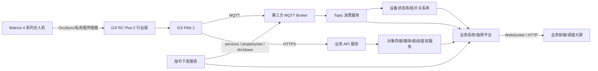
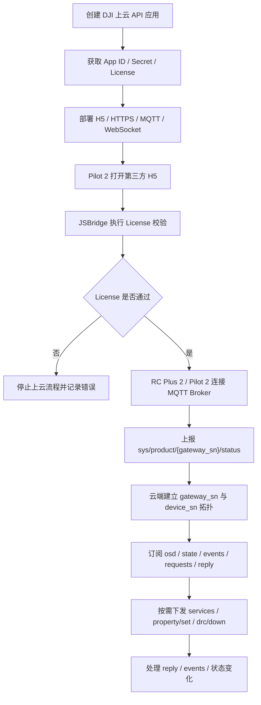
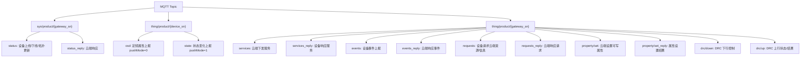
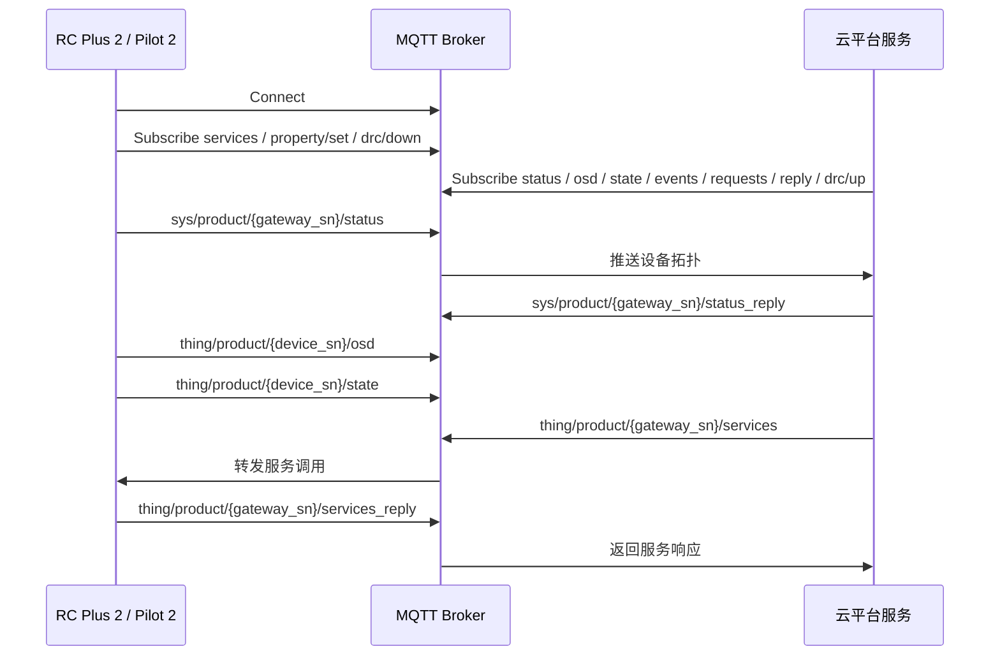
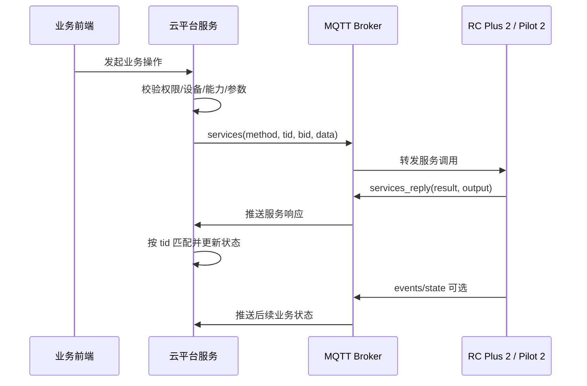
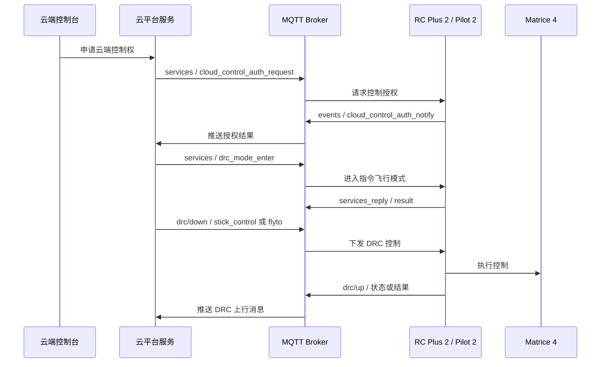

# DJI Pilot 上云 API 接入技术说明

## 1. 背景说明

DJI Pilot 上云 API 的核心是让第三方云平台通过 DJI Pilot 2、遥控器网关和 MQTT/HTTPS/WebSocket 等链路，接入无人机设备状态、服务调用、直播、媒体、航线和指令飞行能力。

本文限定接入组合为：

1. **无人机**：DJI Matrice 4 系列。
2. **控制器**：DJI RC Plus 2 行业版。
3. **上云入口**：DJI Pilot 2 / Pilot 上云。
4. **核心协议**：MQTT，辅以 HTTPS、WebSocket、JSBridge 和对象存储。

需要先明确边界：**Matrice 4 系列无人机本体不直接连接第三方云平台，Pilot 上云场景通常由 DJI RC Plus 2 行业版和 DJI Pilot 2 承担网关与上云入口。** 云平台通过 MQTT Topic 接收状态、事件和响应，通过 MQTT/HTTPS 下发服务调用、属性设置、直播、媒体、航线和 DRC 相关业务。

本文只依据 DJI 官方 Cloud API 文档及其页面内可追溯链接整理。对于型号能力差异、固件差异、Pilot 2 版本差异、直播协议可用性和飞控能力开放边界，均需以 DJI 官方兼容性说明和项目现场验证为准。

## 2. 核心概念

| 概念 | 说明 |
|---|---|
| Pilot 上云 | DJI Pilot 2 加载第三方 H5 页面，并通过 JSBridge、MQTT、HTTPS、WebSocket 等能力接入第三方云平台。 |
| DJI RC Plus 2 行业版 | Pilot 上云场景中的关键网关设备，通常承担 MQTT 连接、拓扑上报、服务调用承载和 DRC 控制链路承载。 |
| Matrice 4 系列 | 本文限定的飞行器系列，提供飞行状态、电池、定位、返航、避障、云台/相机、航线和指令飞行相关能力。 |
| MQTT Broker | 第三方云平台提供的 MQTT 消息路由中心，设备和云端服务均通过 Topic 发布/订阅消息。 |
| `gateway_sn` | 网关设备 SN。Pilot 上云场景通常对应 DJI RC Plus 2 行业版，应避免误用飞行器 SN 拼接网关 Topic。 |
| `device_sn` | 具体设备 SN，可表示飞行器、遥控器、负载等设备。`osd`、`state` 等状态上报可能来自具体 `device_sn`。 |
| `tid` | 单次事务 ID，用于一次请求和响应匹配，例如 `services` 与 `services_reply`。 |
| `bid` | 业务链路 ID，用于把多个事务串成同一业务流程，例如一次直播、一次航线流程、一段 DRC 控制会话。 |
| `seq` | DRC 控制消息序号，用于控制链路中的顺序处理、去重和排障。 |
| `services_reply` | 设备对云端服务调用的响应，表示服务调用是否被接受或处理，不等同于所有后续业务最终成功。 |
| `pushMode=0` | DJI 物模型中定频上报属性，对应 `thing/product/{device_sn}/osd`。 |
| `pushMode=1` | DJI 物模型中状态变化上报属性，对应 `thing/product/{device_sn}/state`。 |
| `accessMode=rw` | 可读写属性。只有此类属性才适合通过 `property/set` 设置。 |

## 3. 总体接入架构



第三方云平台建议至少包含以下能力：

| 组件 | 作用 | 接入关注点 |
|---|---|---|
| MQTT Broker | 承载拓扑、状态、事件、服务、属性设置、DRC 上下行。 | Topic 鉴权、TLS、连接稳定性、消息路由。 |
| Topic 消费服务 | 订阅并解析上行 Topic。 | `gateway_sn`、`device_sn`、`tid`、`bid`、`method` 的统一处理。 |
| 指令下发服务 | 发布 `services`、`property/set`、`drc/down` 等下行消息。 | 权限校验、幂等、超时、审计、控制权。 |
| 设备状态库/拓扑关系库 | 保存网关、无人机、负载、在线状态、最新 OSD/State 和业务状态。 | 正确区分 `gateway_sn` 与 `device_sn`，保留拓扑变化历史。 |
| HTTPS 业务服务 | 承载登录、Token、媒体、航线、临时凭证、业务回调。 | 文件 URL、对象存储、权限、有效期。 |
| 业务系统/指挥平台 | 汇聚设备状态、任务、媒体、航线和控制流程。 | 不能绕过 MQTT 状态机直接假定设备动作成功。 |
| 业务前端/调度大屏 | 展示地图态势、设备位置、告警、任务和控制结果。 | WebSocket/HTTP 只用于业务展示和交互，不替代 MQTT 设备消息链路。 |

## 4. Pilot 上云接入流程图



接入时应先打通“License + MQTT 连接 + 拓扑 + 状态上报”这条最小链路，再接入直播、媒体、航线和 DRC。不要一开始就直接做飞控类能力，否则问题容易混在鉴权、拓扑、Topic、设备能力和控制权限之间。

## 5. MQTT Topic 与消息方向

### 5.1 Topic 分类图



### 5.2 Topic 与方向表

| 场景 | Topic | Direction | 用途 | 云平台处理 |
|---|---|---|---|---|
| 拓扑上报 | `sys/product/{gateway_sn}/status` | up | 网关上线、下线、拓扑更新。 | 建立或更新网关、飞行器、负载关系。 |
| 拓扑响应 | `sys/product/{gateway_sn}/status_reply` | down | 云端确认 `status` 处理结果。 | 按 `tid` 返回处理结果。 |
| OSD 状态 | `thing/product/{device_sn}/osd` | up | 定频属性上报，`pushMode=0`。 | 更新实时快照、地图态势、时序数据。 |
| State 状态 | `thing/product/{device_sn}/state` | up | 状态变化上报，`pushMode=1`。 | 触发告警、状态机和业务事件。 |
| 服务调用 | `thing/product/{gateway_sn}/services` | down | 云端主动调用设备服务。 | 发布指令并等待 `services_reply`。 |
| 服务响应 | `thing/product/{gateway_sn}/services_reply` | up | 设备返回服务调用结果。 | 按 `tid` 匹配请求，记录 `result/output`。 |
| 事件上报 | `thing/product/{gateway_sn}/events` | up | 设备上报事件。 | 按 `method` 分发，必要时回复。 |
| 事件响应 | `thing/product/{gateway_sn}/events_reply` | down | 云端响应设备事件。 | 对 `need_reply=true` 的事件返回结果。 |
| 设备请求 | `thing/product/{gateway_sn}/requests` | up | 设备请求云端资源或信息。 | 返回临时凭证、配置或业务数据。 |
| 请求响应 | `thing/product/{gateway_sn}/requests_reply` | down | 云端响应设备请求。 | 按 `tid/method` 返回结果。 |
| 属性设置 | `thing/product/{gateway_sn}/property/set` | down | 设置可写属性。 | 仅设置 `accessMode=rw` 属性。 |
| 属性响应 | `thing/product/{gateway_sn}/property/set_reply` | up | 返回属性设置结果。 | 更新设置状态和审计记录。 |
| DRC 下行 | `thing/product/{gateway_sn}/drc/down` | down | 下发 DRC 心跳、杆量、目标点或控制数据。 | 做控制权校验、频率限制和审计。 |
| DRC 上行 | `thing/product/{gateway_sn}/drc/up` | up | 返回 DRC 状态、结果或高频状态。 | 按 `seq` 处理顺序、丢包和状态。 |

### 5.3 MQTT 通信链路图



## 6. 接入前置条件与检查清单

在进入具体 MQTT 接口开发前，建议先完成以下检查。否则后续问题容易混在“License 未通过、MQTT 不通、SN 用错、设备未上线、Topic 方向错误、能力不支持”之间。

| 检查项 | 通过标准 |
|---|---|
| DJI 开发者应用 | 已创建上云 API 应用，获得 App ID、App Secret、App License。 |
| Pilot H5 | Pilot 2 可以访问第三方 H5 页面，H5 能完成登录和 JSBridge 调用。 |
| License 校验 | H5 已通过 `platformVerifyLicense` 完成 License 校验。 |
| MQTT Broker | RC Plus 2 / Pilot 2 能连接 Broker，云端服务能发布和订阅 Topic。 |
| Topic 订阅 | 云端已订阅 `status`、`osd`、`state`、`events`、`requests`、`services_reply`、`property/set_reply`、`drc/up`。 |
| 设备标识 | 已区分 `gateway_sn` 和 `device_sn`，并能从拓扑中建立映射。 |
| 状态存储 | 已能保存设备在线状态、最新 OSD、状态事件、服务调用记录和错误码。 |
| 权限与审计 | 已能记录操作者、目标设备、method、参数、结果和时间。 |
| 直播/媒体/航线资源 | 已准备流媒体服务、对象存储、HTTPS URL、临时凭证或业务接口。 |
| DRC 安全边界 | 已明确控制权、限流、急停、人工接管和现场飞行验证要求。 |

## 7. 核心调用清单

本章面向研发接入说明。表中的 `method` 和 `data` 只做工程归纳，具体字段、枚举、必填项和错误码必须以 DJI 官方物模型或对应功能页面为准。

| 模块 | Topic / 接口 | Direction | 关键 method | 关键数据 | 云端处理 |
|---|---|---|---|---|---|
| 设备上线 / 拓扑 | `sys/product/{gateway_sn}/status` | up | `update_topo` 等，以官方页面为准 | `gateway_sn`、子设备 SN、设备类型、版本、拓扑关系 | 更新设备资产和拓扑，发布 `status_reply`。 |
| OSD 状态 | `thing/product/{device_sn}/osd` | up | 无固定服务 method | 飞行状态、位置、电量、链路、存储等 | 更新实时态势和设备快照。 |
| State 状态 | `thing/product/{device_sn}/state` | up | 无固定服务 method | 状态变化属性、事件性状态 | 推进状态机、告警和业务事件。 |
| 属性设置 | `thing/product/{gateway_sn}/property/set` | down | 按属性模型 | 可写属性和值 | 校验 `accessMode=rw`，发布设置请求。 |
| 属性响应 | `thing/product/{gateway_sn}/property/set_reply` | up | 与属性设置对应 | `tid`、`result`、设置结果 | 按 `tid` 更新设置结果。 |
| 服务调用 | `thing/product/{gateway_sn}/services` | down | 以官方服务 method 为准 | `tid`、`bid`、`gateway`、`data` | 下发直播、指令飞行、远程控制等服务。 |
| 服务响应 | `thing/product/{gateway_sn}/services_reply` | up | 与请求 method 对应 | `tid`、`bid`、`result`、`output` | 匹配请求，推进业务状态。 |
| 事件通知 | `thing/product/{gateway_sn}/events` | up | 以官方事件 method 为准 | `need_reply`、`data` | 分发事件，必要时发布 `events_reply`。 |
| 设备请求 | `thing/product/{gateway_sn}/requests` | up | 以官方请求 method 为准 | 资源请求、临时凭证请求、配置请求等 | 查询业务数据并发布 `requests_reply`。 |
| DRC 下行 | `thing/product/{gateway_sn}/drc/down` | down | 以 DRC/远程控制页面为准 | `seq`、杆量、目标点、心跳等 | 下发控制数据，做控制权和频率校验。 |
| DRC 上行 | `thing/product/{gateway_sn}/drc/up` | up | 以 DRC/远程控制页面为准 | `seq`、控制结果、状态或高频 OSD | 更新控制状态并判断链路健康。 |
| 直播 | `services/services_reply`，配合 `live_capacity`、`live_status` | both | `live_start_push`、停止直播、设置清晰度/镜头等 | 视频源、协议、清晰度、推流地址 | 查询能力、发起推流、更新直播状态。 |
| 媒体 | HTTPS 媒体接口，配合 MQTT 请求/事件 | both | 以 Pilot 媒体管理页面为准 | 文件指纹、临时凭证、上传结果、文件组 | 生成凭证、接收回调、保存元数据。 |
| 航线 / 任务 | HTTPS 航线接口，必要时配合 MQTT 服务/事件 | both | 以 Pilot 航线管理页面为准 | 航线列表、上传凭证、下载地址、WPML 文件 | 管理航线文件和任务状态。 |

研发实现时至少需要：

1. 订阅 `sys/product/+/status`，优先打通设备上线和拓扑。
2. 订阅 `thing/product/+/osd` 与 `thing/product/+/state`，区分实时状态和状态变化。
3. 具备向 `thing/product/{gateway_sn}/services` 发布服务调用的能力。
4. 订阅 `services_reply`，用于判断接口调用是否被设备侧接受或处理。
5. 订阅 `events` 和 `requests`，处理授权通知、状态事件、资源请求等上行消息。
6. 具备向 `property/set` 发布可写属性设置请求的能力。
7. 如接入指令飞行或远程控制，单独实现 `drc/down` 与 `drc/up` 链路。

## 8. 研发接入流程

### 8.1 最小可用链路

1. 创建 DJI 上云 API 应用，准备 App ID、App Secret、App License。
2. 部署 Pilot H5、HTTPS 服务、MQTT Broker、WebSocket 服务和对象存储。
3. 在 Pilot 2 中打开第三方 H5，并通过 JSBridge 完成 License 校验。
4. 让 RC Plus 2 / Pilot 2 建立 MQTT 连接。
5. 云端订阅 `sys/product/+/status`，接收网关和子设备拓扑。
6. 建立 `gateway_sn`、`device_sn`、工作空间和用户权限关系。
7. 云端订阅并消费 `osd/state`，形成设备实时态势。
8. 实现 `services` 发布和 `services_reply` 匹配。
9. 实现 `property/set` 发布和 `property/set_reply` 匹配。
10. 在拓扑、状态、服务调用稳定后，再接入直播、媒体、航线和 DRC。

### 8.2 设备上线与拓扑处理

`sys/product/{gateway_sn}/status` 是 Pilot 上云接入的第一条关键链路。云端收到拓扑消息后，应至少完成：

1. 从 Topic 提取 `{gateway_sn}`。
2. 校验消息体中的 `gateway` 或拓扑字段是否与 Topic 中网关一致。
3. 解析子设备列表，识别 Matrice 4 系列飞行器、负载和网关设备。
4. 保存设备类型、子类型、版本、在线状态和拓扑关系。
5. 发布 `sys/product/{gateway_sn}/status_reply`。
6. 将拓扑关系提供给后续状态上报、服务调用、直播、媒体、航线和 DRC 模块。

注意：服务调用、属性设置和 DRC 通常围绕 `{gateway_sn}` 下发，而 `osd/state` 可能来自具体 `{device_sn}`。如果这一步没有建好映射，后续很容易出现“状态能收到但指令发不到正确设备”的问题。

### 8.3 状态消费

| Topic | 处理重点 | 存储建议 |
|---|---|---|
| `thing/product/{device_sn}/osd` | 定频属性，例如位置、飞行状态、电量、链路、存储等。 | 最新快照、缓存、时序数据。 |
| `thing/product/{device_sn}/state` | 状态变化属性，例如模式变化、告警、事件性状态。 | 事件表、状态机、告警流。 |

处理规则：

- 高频 `osd` 不建议全部写入事务型主库。
- `state` 更适合进入可靠队列，由业务事件服务消费。
- 字段解析应按设备类型和官方物模型拆分，不建议建立一个巨大的固定字段表。
- `mode_code`、电池、定位、返航、避障、控制源等字段可作为飞行安全和业务展示的重要输入。

### 8.4 服务调用

服务调用采用“发布 `services` -> 等待 `services_reply` -> 继续观察状态或事件”的模式。



处理规则：

- `tid` 用于匹配本次请求和 `services_reply`。
- `bid` 用于把一次业务流程中的多个 `tid` 串起来。
- `method` 必须来自 DJI 官方物模型或具体功能页面。
- `services_reply.result = 0` 不应被简单等同为直播、航线或飞控动作最终成功。
- 超时未收到 `services_reply` 时，应将请求置为超时，并保留重试或人工处理入口。

### 8.5 属性设置

属性设置采用 `property/set` 与 `property/set_reply`：

1. 查询或确认目标属性来自官方物模型。
2. 确认属性 `accessMode=rw`。
3. 校验操作者权限、目标设备、属性范围和枚举值。
4. 发布 `thing/product/{gateway_sn}/property/set`。
5. 等待 `property/set_reply`，记录结果。

注意：不要向只读属性下发设置。属性范围、枚举值和字段结构以 DJI 官方物模型页面为准。

### 8.6 直播接入

直播建议流程：

1. 读取或消费 RC Plus 2 的 `live_capacity`，判断可直播设备、镜头和协议能力。
2. 根据项目选择 Agora、RTMP、RTSP、GB28181 或官方页面中支持的其他方式。
3. 准备流媒体服务地址、鉴权和播放链路。
4. 通过 `services` 下发开始推流请求，例如 `live_start_push`，具体 method 和 `data` 以官方直播页面为准。
5. 通过 `services_reply` 判断接口调用结果。
6. 通过 `live_status`、事件或业务回调更新直播状态。
7. 停止直播时下发停止推流服务。

直播协议的实际可用性与 Pilot 2 版本、RC Plus 2 版本、网络、流媒体服务和部署方式有关，需以 DJI 官方兼容性说明和现场验证为准。

### 8.7 媒体与航线接入

媒体与航线主要走 HTTPS、对象存储和临时凭证，MQTT 更多承担触发、状态和事件通知。

| 模块 | 主要链路 | 云端职责 |
|---|---|---|
| 媒体 | HTTPS + 对象存储 + MQTT 请求/事件 | 提供临时凭证、接收上传结果、保存文件组和元数据。 |
| 航线 | HTTPS + 对象存储 + WPML 文件 + MQTT 状态/事件 | 提供航线列表、上传凭证、下载地址、重名检查、任务状态处理。 |

注意：媒体文件和航线文件不应通过 MQTT 直接传输。Matrice 4 系列与 WPML 航线能力的兼容边界需以 DJI 官方兼容性说明为准。

### 8.8 DRC / 指令飞行接入

DRC 和远程控制属于高风险能力，建议单独设计、单独联调、单独开关。

典型流程：

1. 云端通过 `services` 发起云端控制权申请，例如 `cloud_control_auth_request`。
2. Pilot/设备通过 `events` 上报授权通知，例如 `cloud_control_auth_notify`。
3. 授权成功后，云端通过 `services` 发起进入指令飞行模式，例如 `drc_mode_enter`。
4. 进入成功后，云端通过 `drc/down` 发送心跳、杆量、目标点或控制指令。
5. 设备通过 `drc/up` 返回状态、结果或高频 OSD。
6. 发生超时、失联、权限变化、人工接管或急停时，云端停止下发控制。



DRC 接入必须具备：

- 控制权校验。
- 操作审计。
- 频率限制。
- `seq` 顺序和去重处理。
- 急停、返航、降落等高风险操作的权限隔离。
- 人工接管和现场飞行验证机制。

## 9. 典型 MQTT / API 示例

本章示例仅用于说明接入形态，不表示完整字段表。`method`、`data`、枚举值、必填项和错误码均需以 DJI 官方物模型页面或具体功能页面为准。

### 9.1 Topic 订阅与发布示例

云端最小订阅集合：

```text
sys/product/+/status
thing/product/+/osd
thing/product/+/state
thing/product/+/services_reply
thing/product/+/events
thing/product/+/requests
thing/product/+/property/set_reply
thing/product/+/drc/up
```

云端常用发布 Topic：

```text
sys/product/{gateway_sn}/status_reply
thing/product/{gateway_sn}/services
thing/product/{gateway_sn}/events_reply
thing/product/{gateway_sn}/requests_reply
thing/product/{gateway_sn}/property/set
thing/product/{gateway_sn}/drc/down
```

### 9.2 `status` 上线 / 拓扑处理示例

```json
{
  "tid": "设备消息事务ID",
  "bid": "设备消息业务ID或为空",
  "timestamp": 1710000000000,
  "gateway": "RC_PLUS_2_SN",
  "method": "update_topo",
  "data": {
    "gateway_sn": "RC_PLUS_2_SN",
    "sub_devices": [
      {
        "device_sn": "MATRICE_4_SN",
        "device_type": "以官方设备类型为准",
        "device_sub_type": "以官方设备子类型为准"
      }
    ]
  }
}
```

云端处理建议：

1. 从 Topic 提取 `gateway_sn`。
2. 校验消息体中的网关 SN 与 Topic 中的 `{gateway_sn}` 是否一致。
3. 解析子设备列表并更新拓扑。
4. 记录在线状态、版本和设备关系。
5. 发布 `sys/product/{gateway_sn}/status_reply`。

`status_reply` 示例：

```json
{
  "tid": "与 status 消息一致",
  "bid": "与 status 消息一致或按官方要求填写",
  "timestamp": 1710000001000,
  "result": 0
}
```

### 9.3 `osd/state` 消费示例

```json
{
  "tid": "设备消息事务ID",
  "bid": "业务ID",
  "timestamp": 1710000000000,
  "gateway": "RC_PLUS_2_SN",
  "data": {
    "mode_code": "飞行状态，具体枚举以官方物模型为准",
    "battery": "电池信息，结构以官方物模型为准",
    "position_state": "定位状态，结构以官方物模型为准"
  }
}
```

处理方式：

```text
if topic endsWith "/osd":
  更新实时快照
  写入必要时序数据
  推送地图态势

if topic endsWith "/state":
  更新状态机
  触发告警或业务事件
  记录状态变化日志
```

### 9.4 `services` 请求与响应模板

请求模板：

```json
{
  "tid": "云端生成的事务ID",
  "bid": "同一业务流程的业务ID",
  "timestamp": 1710000000000,
  "gateway": "RC_PLUS_2_SN",
  "method": "具体服务方法名，以 DJI 官方页面为准",
  "data": {
    "参数": "以对应 method 的官方定义为准"
  }
}
```

响应模板：

```json
{
  "tid": "与 services 请求一致",
  "bid": "与 services 请求一致",
  "timestamp": 1710000001000,
  "gateway": "RC_PLUS_2_SN",
  "method": "与请求对应的服务方法名",
  "result": 0,
  "output": {
    "结果数据": "以官方定义为准"
  }
}
```

处理规则：

- 保存 `tid`、`bid`、`gateway_sn`、`method`、请求体、发布时间和超时时间。
- 收到 `services_reply` 后按 `tid` 匹配。
- `result != 0` 时记录错误码和上下文。
- 对直播、航线、DRC 等长流程，继续等待状态或事件确认最终结果。

### 9.5 `property/set` 请求与响应模板

请求模板：

```json
{
  "tid": "云端生成的事务ID",
  "bid": "业务ID",
  "timestamp": 1710000000000,
  "gateway": "RC_PLUS_2_SN",
  "data": {
    "属性名": "目标值，属性名和值以官方物模型为准"
  }
}
```

响应模板：

```json
{
  "tid": "与 property/set 请求一致",
  "bid": "与 property/set 请求一致",
  "timestamp": 1710000001000,
  "result": 0,
  "data": {
    "属性名": {
      "result": 0
    }
  }
}
```

注意：只设置官方物模型中 `accessMode=rw` 的属性，设置前必须校验权限、范围和枚举值。

### 9.6 DRC 控制链路示例

```json
{
  "tid": "云端生成的事务ID",
  "bid": "本次 DRC 控制会话ID",
  "timestamp": 1710000000000,
  "gateway": "RC_PLUS_2_SN",
  "method": "DRC 控制方法，以官方页面为准",
  "data": {
    "seq": 1,
    "control": "杆量、目标点或心跳等数据，以官方定义为准"
  }
}
```

处理规则：

- 杆量控制涉及 `roll`、`pitch`、`throttle`、`yaw` 等字段，具体范围、频率和方向以 DJI 官方远程控制页面为准。
- `seq` 应在同一控制会话内递增，用于顺序处理和去重。
- 云端应记录最近发送、最近确认、最近上行状态和链路超时时间。

### 9.7 直播调用示例

```json
{
  "tid": "云端生成的事务ID",
  "bid": "本次直播业务ID",
  "timestamp": 1710000000000,
  "gateway": "RC_PLUS_2_SN",
  "method": "live_start_push",
  "data": {
    "video_id": "视频源ID，以官方定义为准",
    "url_type": "直播协议类型，以官方定义为准",
    "url": "流媒体推流地址",
    "video_quality": "清晰度，以官方定义为准"
  }
}
```

说明：Pilot 直播页面列出 Agora、RTMP、RTSP、GB28181；RC Plus 2 API 页面出现 WebRTC/WHIP 相关参数。项目实际启用哪种协议，需以 Pilot 版本、RC Plus 2 版本、流媒体服务和现场网络验证为准。

### 9.8 媒体与航线流程示例

媒体上传流程：

```text
1. Pilot 或设备侧发起媒体上传相关请求。
2. 云端检查文件指纹或文件组信息。
3. 云端返回对象存储临时凭证或上传地址。
4. Pilot/设备将文件上传到对象存储。
5. 云端接收上传结果或文件组完成回调。
6. 云端保存媒体元数据，并通知业务前端刷新。
```

航线文件流程：

```text
1. 云端提供航线列表、上传凭证、下载地址和重名检查接口。
2. Pilot H5 上传或下载 WPML 航线文件。
3. 云端保存航线文件元数据和对象存储地址。
4. 下发或执行航线任务时，按 DJI Pilot 航线管理页面和 WPML 文档处理。
5. 任务状态通过 MQTT 服务响应、事件或状态上报推进，具体以官方功能页面为准。
```

### 9.9 `tid` / `bid` / `seq` 关联说明

| 标识 | 粒度 | 用途 | 建议 |
|---|---|---|---|
| `tid` | 单次 MQTT 请求或响应 | 匹配 `services_reply`、`property/set_reply`、`requests_reply`、`events_reply`。 | 使用 UUID，保存请求时间、Topic、method、gateway_sn、超时时间。 |
| `bid` | 一次业务流程 | 关联直播开始到停止、一次航线流程、一段 DRC 控制会话。 | 由业务服务生成，同一流程内多个 `tid` 共享同一 `bid`。 |
| `seq` | DRC 控制消息序列 | 控制顺序、去重、排查丢包或乱序。 | 在同一 DRC 会话内递增，重新授权后重建会话状态。 |

请求状态机建议：

```text
CREATED -> PUBLISHED -> REPLIED_SUCCESS
                    -> REPLIED_FAILED
                    -> TIMEOUT
                    -> CANCELED
```

## 10. Matrice 4 系列接入说明

| 关注点 | 说明 |
|---|---|
| 物模型依据 | 使用 `m4-series/properties` 页面作为飞行器属性依据。 |
| 状态上报 | `pushMode=0` 属性通过 `osd` 定频上报；`pushMode=1` 属性通过 `state` 状态变化上报。 |
| 属性设置 | 只有 `accessMode=rw` 的属性可通过 `property/set` 修改。 |
| 飞行状态 | `mode_code` 覆盖待机、起飞准备、手动飞行、航线飞行、自动返航、自动降落、指令飞行等状态。 |
| 安全能力 | 返航、避障、限高、夜航灯、电池、控制源等应作为飞行安全策略的重要输入。 |
| 维护管理 | 激活时间、保养信息、飞行总架次、总航时、总里程可用于设备画像和维护计划。 |
| 能力差异 | 具体型号、负载、固件和地区限制可能影响能力可用性，需以 DJI 官方兼容性说明为准。 |

开发接入建议：

1. 不要只根据“Matrice 4 系列”硬编码能力。
2. 结合官方物模型、设备实时上报、Pilot 版本、负载信息和现场联调结果建立能力矩阵。
3. 飞行状态、电池、定位、返航、避障和控制源字段应进入飞行安全策略。
4. 对可写属性建立白名单，避免误设置只读或高风险属性。

## 11. DJI RC Plus 2 行业版接入说明

| 关注点 | 说明 |
|---|---|
| 网关身份 | RC Plus 2 是 Pilot 上云中的关键网关设备，`gateway_sn` 通常指向该设备。 |
| 设备管理 | 通过 `status/update_topo` 上报网关和子设备拓扑。 |
| 属性能力 | 属性页面包含直播能力、整体直播状态、图传链路、4G Dongle、固件版本、云控授权、DRC 链路状态等。 |
| 指令飞行 | 指令飞行页面包含云控授权、进入/退出指令飞行模式、一键起飞、flyto、返航、POI、DRC 高频 OSD 等能力。 |
| 远程控制 | 远程控制页面包含 DRC 心跳、杆量控制、急停、强制降落、相机/云台/负载控制等能力。 |
| 直播 | 直播页面包含直播能力、直播状态、开始/停止推流、清晰度和镜头相关能力。 |
| 能力差异 | RC Plus 2、Pilot 2、固件、网络和项目权限都会影响能力可用性，需以 DJI 官方兼容性说明为准。 |

开发接入建议：

1. 以 RC Plus 2 的 `gateway_sn` 作为服务调用、属性设置和 DRC 的主要 Topic 标识。
2. 通过拓扑关系关联 RC Plus 2、Matrice 4 和负载。
3. 直播接入前先判断 `live_capacity`，不要假设所有镜头和协议都可用。
4. 云控授权、DRC、杆量控制、急停、返航、降落等能力必须经过现场验证和权限审查。

## 12. 注意事项与限制

| 注意事项 | 说明 |
|---|---|
| 不要混淆 `gateway_sn` 和 `device_sn` | 网关 Topic 通常使用 `{gateway_sn}`，状态 Topic 可能使用具体 `{device_sn}`。 |
| 不要把 `services_reply.result = 0` 当作最终业务成功 | 服务响应只代表接口层处理结果，长流程仍需等待事件、状态或业务回调。 |
| 不要伪造 method 和 data 字段 | 所有 `method`、`data`、枚举值和必填项应以官方物模型和功能页面为准。 |
| 高频 OSD 不宜全部入主库 | 建议区分实时缓存、时序数据和业务快照。 |
| 属性设置只针对可写属性 | 仅设置 `accessMode=rw` 属性，并进行权限、范围和枚举校验。 |
| 媒体和航线文件不要走 MQTT 传输 | 大文件应通过 HTTPS、对象存储和临时凭证处理。 |
| DRC 是高风险能力 | 必须有控制权、审计、限流、急停兜底和人工接管机制。 |
| 直播协议需现场验证 | 协议可用性受 Pilot 版本、RC Plus 2 版本、网络和流媒体服务影响。 |
| 证书和 TLS 需按项目安全要求设计 | DJI 文档提到 TLS、clientAuth 和证书链要求，实际策略需结合项目安全规范。 |
| 型号和固件存在差异 | Matrice 4、RC Plus 2、Pilot 2 的能力以官方兼容性说明和现场设备版本为准。 |

## 13. 待确认事项

| 问题 | 原因 |
|---|---|
| Matrice 4 系列具体子型号与负载在当前固件下支持的完整物模型字段。 | 同一系列不同型号、负载和固件可能存在能力差异。 |
| RC Plus 2 行业版、DJI Pilot 2 的最低兼容版本。 | JSBridge、直播、DRC、远程控制能力可能与版本相关。 |
| DRC、杆量控制、flyto、急停、返航、降落等能力是否允许在项目中开放。 | 飞控能力属于高风险操作，需要明确合规边界和安全责任。 |
| 直播协议最终选型。 | Agora、RTMP、RTSP、GB28181、WebRTC/WHIP 的可用性受版本、网络和服务器影响。 |
| SSL 双向认证、证书链、Broker 鉴权策略。 | 需要满足项目安全要求和 DJI 官方连接要求。 |
| WPML 航线文件与 Matrice 4 系列实际任务能力的兼容边界。 | 航线能力与机型、负载、Pilot 版本和任务类型有关。 |
| 各服务 method 的完整参数、错误码和超时时间。 | 本文只做工程模板，最终实现需按官方具体页面逐项确认。 |

## 14. 结论

Pilot 上云 API 的接入重点不是单个接口，而是一套由 Pilot 2、RC Plus 2、MQTT Topic、物模型、HTTPS 文件服务、WebSocket 态势推送和业务状态机组成的端边云协作体系。

面向研发落地，推荐路径是：

1. 完成 DJI 应用、License、H5、MQTT Broker 和基础服务部署。
2. 先打通 `status` 拓扑链路，建立 `gateway_sn` 与 `device_sn` 的关系。
3. 再消费 `osd/state`，形成设备实时态势和状态机。
4. 接入 `services/services_reply` 和 `property/set/property/set_reply`，形成基础控制能力。
5. 按需接入直播、媒体、航线和 DRC，并对 DRC 单独设置权限、审计和现场验证机制。

一句话概括：**云平台不是直接控制无人机本体，而是通过 Pilot 2 / RC Plus 2 这个网关入口，基于 DJI 官方 Topic 和物模型完成状态订阅、服务调用、资源协作和安全受控的业务闭环。**

## 参考资料

- [Topic 定义](https://developer.dji.com/doc/cloud-api-tutorial/cn/api-reference/pilot-to-cloud/mqtt/topic-definition.html)
- [产品架构](https://developer.dji.com/doc/cloud-api-tutorial/cn/overview/product-architecture.html)
- [MQTT](https://developer.dji.com/doc/cloud-api-tutorial/cn/overview/basic-concept/mqtt.html)
- [物模型](https://developer.dji.com/doc/cloud-api-tutorial/cn/overview/basic-concept/thing-model.html)
- [产品支持](https://developer.dji.com/doc/cloud-api-tutorial/cn/overview/product-support.html)
- [Pilot 上云](https://developer.dji.com/doc/cloud-api-tutorial/cn/feature-set/pilot-feature-set/pilot-access-to-cloud.html)
- [Pilot 直播功能](https://developer.dji.com/doc/cloud-api-tutorial/cn/feature-set/pilot-feature-set/pilot-livestream.html)
- [Pilot 媒体管理](https://developer.dji.com/doc/cloud-api-tutorial/cn/feature-set/pilot-feature-set/pilot-media-management.html)
- [Pilot 航线管理](https://developer.dji.com/doc/cloud-api-tutorial/cn/feature-set/pilot-feature-set/pilot-wayline-management.html)
- [Pilot 态势感知](https://developer.dji.com/doc/cloud-api-tutorial/cn/feature-set/pilot-feature-set/pilot-situation-awareness.html)
- [Matrice 4 系列设备属性](https://developer.dji.com/doc/cloud-api-tutorial/cn/api-reference/pilot-to-cloud/mqtt/m4-series/properties.html)
- [DJI RC Plus 2 设备属性](https://developer.dji.com/doc/cloud-api-tutorial/cn/api-reference/pilot-to-cloud/mqtt/dji-rc-plus-2/properties.html)
- [DJI RC Plus 2 设备管理](https://developer.dji.com/doc/cloud-api-tutorial/cn/api-reference/pilot-to-cloud/mqtt/dji-rc-plus-2/device.html)
- [DJI RC Plus 2 直播功能](https://developer.dji.com/doc/cloud-api-tutorial/cn/api-reference/pilot-to-cloud/mqtt/dji-rc-plus-2/live.html)
- [DJI RC Plus 2 指令飞行](https://developer.dji.com/doc/cloud-api-tutorial/cn/api-reference/pilot-to-cloud/mqtt/dji-rc-plus-2/drc.html)
- [DJI RC Plus 2 远程控制](https://developer.dji.com/doc/cloud-api-tutorial/cn/api-reference/pilot-to-cloud/mqtt/dji-rc-plus-2/remote-control.html)

## 审查记录

生成文件后已完成一次全文审查：

- 已检查新文档参考了“大疆航线文件提供技术说明.md”的组织风格：背景说明、核心概念、总体架构、检查清单、研发接入说明、注意事项、结论、参考资料、审查记录。
- 已检查没有覆盖原始文档 `DJI-Pilot-Cloud-API-Technical-Report.md`，新文件单独输出为 `DJI-Pilot-Cloud-API-接入技术说明.md`。
- 已检查主题聚焦 DJI Pilot 上云 API、MQTT、Matrice 4 系列、DJI RC Plus 2 行业版。
- 已检查 Topic 方向保持一致：`osd/state/events/requests/services_reply/property/set_reply/drc/up/status` 为上行或设备到云，`services/property/set/events_reply/requests_reply/drc/down/status_reply` 为下行或云到设备。
- 已检查 `gateway_sn`、`device_sn`、`tid`、`bid`、`seq` 的说明在核心概念、Topic、研发流程和示例中保持一致。
- 已检查示例均为工程模板，并对依赖具体物模型的 `method`、`data` 标注“以 DJI 官方页面为准”。
- 已检查 Mermaid 图例包含总体架构图、Pilot 上云接入流程图、Topic 分类图、MQTT 通信链路图、服务调用时序图、DRC 时序图，语法结构合理。
- 已检查参考资料均为 DJI 官方开发者文档链接，未引入非官方来源。
- 已检查待确认事项覆盖型号能力、版本、DRC 合规、直播协议、证书鉴权、WPML 航线兼容性和服务 method 参数等未确定内容。
