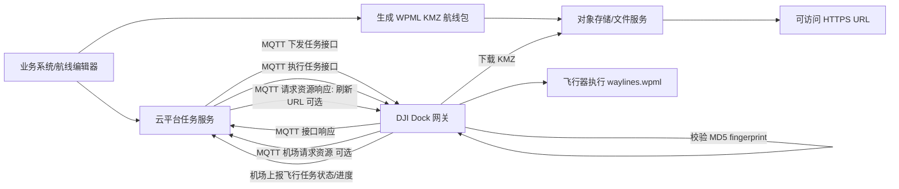
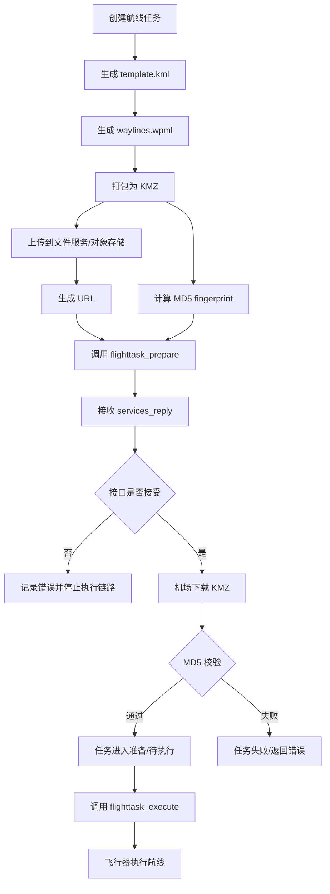
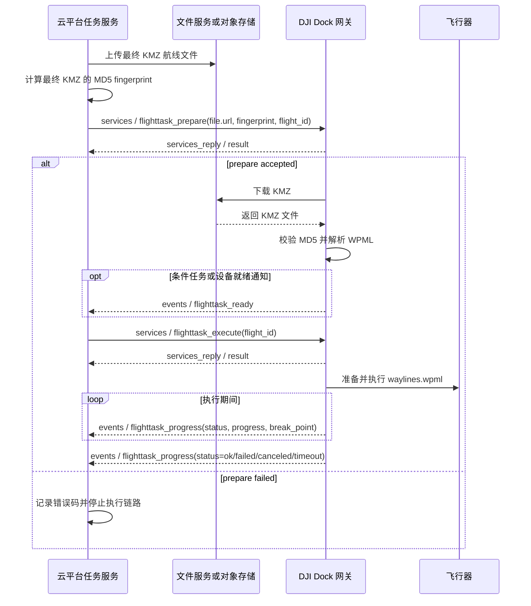

# 如何向大疆无人机提供航线文件的技术说明

## 1. 背景说明

大疆 Cloud API 的航线任务能力，本质上分为两层：

1. **航线文件格式层**：使用 DJI WPML 标准描述航线文件，最终形成 `.kmz` 文件。
2. **任务下发与执行层**：云平台通过 MQTT 接口，将航线文件 URL、文件指纹和任务参数下发给机场，再由机场/飞行器下载、校验并执行航线任务。

入口页面 `M30 Properties` 并不是航线文件格式标准页面，它属于 Dock to Cloud MQTT 的飞行器设备属性页面。真正与“如何提供航线文件”直接相关的是：

- DJI WPML 航线文件格式标准
- Dock 航线管理功能说明
- Dock to Cloud MQTT 航线任务接口

## 2. 核心概念

| 概念 | 说明 |
|---|---|
| WPML | WayPoint Markup Language，大疆公开的航线文件格式标准，基于 KML 扩展。 |
| KMZ | WPML 航线文件的归档格式，实质是 ZIP 包，文件后缀为 `.kmz`。 |
| `template.kml` | 模板文件，描述业务属性和模板参数，供编辑器或算法生成执行航线。 |
| `waylines.wpml` | 执行文件，描述飞行器实际执行的飞行路径和负载动作。 |
| `res/` | 资源目录，保存航线所需辅助资源，例如精准复拍参考图等。 |
| `gateway_sn` | MQTT Topic 中使用的网关设备 SN，航线任务场景通常指机场网关 SN，应避免误用飞行器 SN。 |
| `flighttask_prepare` | MQTT 下发任务接口，包含航线文件 URL、MD5 指纹、任务类型等。 |
| `flighttask_execute` | MQTT 执行任务接口，通常通过 `flight_id` 启动已准备好的任务。 |
| `services_reply` | 机场对服务调用的响应，表示接口调用是否被接受或处理，不等同于任务最终执行结果。 |
| `flighttask_progress` | 机场上报航线任务进度、状态和断点信息的事件。 |

## 3. 航线文件是什么

根据 DJI WPML 文档，WPML 是航线文件格式标准，基于 KML 扩展；WPML 航线文件遵循 KMZ 归档要求，所有航线文件以 `.kmz` 结尾。

一个标准 WPML 航线包通常包含：

```text
xxx.kmz
├─ template.kml
├─ waylines.wpml
└─ res/
```

其中：

- `template.kml` 是模板文件，可被 DJI Pilot 2、DJI FlightHub 2 或其他软件解析，用于生成最终执行路径和动作。
- `waylines.wpml` 是飞行器直接执行的文件，定义明确的飞行路径和负载动作。
- `res/` 是辅助资源目录。

关键点：**提供给大疆机场/无人机执行的不是单独 XML 字符串，而是符合 WPML 标准的 `.kmz` 航线包。**

## 4. 总体架构图



## 5. 云平台如何准备航线文件

云平台准备航线文件时，建议按以下步骤：

1. 生成或获取符合 WPML 标准的 `.kmz` 文件。
2. 确保包内命名符合规范，至少包含 `template.kml` 和 `waylines.wpml`，需要辅助资源时包含 `res/`。
3. 将 `.kmz` 上传到对象存储或文件服务。
4. 计算文件内容 MD5，作为 `fingerprint`。
5. 生成机场可访问的 HTTPS 下载 URL。
6. 确保 URL 有效期覆盖任务准备、机场下载、异常重试等时间窗口。

注意：WPML 文档明确提示，航线文件内部各文件或文件夹命名需遵循规范，否则可能导致航线文件读取失败。

## 6. 航线文件准备与下发流程图



## 7. 接入前置条件与检查清单

在进入 MQTT 接口开发前，建议先完成以下检查，否则后续问题容易混在“文件生成错误、文件不可达、接口调用失败、设备状态异常”之间，排障成本很高。

| 检查项 | 通过标准 |
|---|---|
| 航线文件 | 已生成符合 WPML 标准的 `.kmz`，且包内包含必要的 `template.kml`、`waylines.wpml` 和资源目录。 |
| 文件校验 | 已对最终上传的 KMZ 文件内容计算 MD5，并保存为 `fingerprint`。 |
| 文件访问 | 已生成机场可访问的 HTTPS URL，签名有效期覆盖任务准备、排队、执行和重试窗口。 |
| 设备标识 | 已确认用于 MQTT Topic 的 `{gateway_sn}`，避免误用飞行器 SN。 |
| MQTT 链路 | 云平台已具备发布 `services`、订阅 `services_reply`、订阅 `events` 的能力。 |
| 状态存储 | 已建立任务表或状态机，能够保存 `flight_id`、`bid`、`tid`、执行状态、错误码和断点信息。 |

## 8. MQTT 任务下发与执行

本章面向研发接入说明。需要先明确边界：**WPML/KMZ 是航线文件规范，MQTT `flighttask_*` 是任务控制与状态交互接口**。云平台不是把航线 XML 内容直接写入 MQTT，而是先提供可下载、可校验的 KMZ 文件，再通过 MQTT 告诉机场准备和执行哪个任务。

### 8.1 API 使用边界

| 对象 | 解决的问题 | 开发关注点 |
|---|---|---|
| WPML / KMZ | 描述航线内容，即飞行路径、航点动作、负载动作和资源文件。 | 包结构、`template.kml`、`waylines.wpml`、坐标高度、动作合法性。 |
| 文件服务 / 对象存储 | 让机场能够下载航线包。 | HTTPS URL、签名有效期、可访问性、最终 KMZ 文件 MD5。 |
| MQTT `flighttask_prepare` | 下发任务准备信息。 | 提供 `flight_id`、`task_type`、`file.url`、`file.fingerprint` 和任务参数。 |
| MQTT `flighttask_execute` | 触发已准备任务执行。 | 通过 `flight_id` 启动任务，并监听执行进度。 |
| MQTT events / requests | 接收状态和资源请求。 | 处理 `flighttask_progress`、`flighttask_ready`、`flighttask_resource_get` 等上行消息。 |

关键结论：

- `flighttask_prepare` **不是文件上传接口**，它只把航线文件 URL、fingerprint 和任务配置交给机场。
- `flighttask_execute` **不是重新下发航线文件**，它通常基于 `flighttask_prepare` 中的 `flight_id` 启动任务。
- `services_reply.result = 0` 只能说明服务调用被设备侧接受或接口处理成功，不能等同于航线任务最终成功。
- 航线任务最终结果应以 `flighttask_progress` 等状态事件为准。

### 8.2 MQTT Topic 与消息方向

Dock to Cloud 的航线任务通过 `gateway_sn` 所在的网关 Topic 交互。这里的 `gateway_sn` 通常指机场网关 SN，不是飞行器 SN；实际取值应以设备拓扑和官方设备绑定关系为准。

| 场景 | Topic | Direction | Method | 用途 |
|---|---|---|---|---|
| 服务调用 | `thing/product/{gateway_sn}/services` | down | `flighttask_prepare`、`flighttask_execute`、`flighttask_pause`、`flighttask_recovery`、`flighttask_undo` | 云平台向机场下发准备、执行、暂停、恢复、取消等控制指令。 |
| 服务响应 | `thing/product/{gateway_sn}/services_reply` | up | 与请求 method 对应 | 机场返回服务调用结果，用于判断接口调用是否被接受。 |
| 事件上报 | `thing/product/{gateway_sn}/events` | up | `flighttask_progress`、`flighttask_ready` | 机场上报任务进度、状态、就绪等事件。 |
| 资源请求 | `thing/product/{gateway_sn}/requests` | up | `flighttask_resource_get` | 机场在需要时向云平台请求航线任务资源。 |
| 资源响应 | `thing/product/{gateway_sn}/requests_reply` | down | `flighttask_resource_get` | 云平台返回航线文件 URL、fingerprint 等资源信息。 |

研发实现时至少需要：

1. 具备向 `services` 发布消息的能力。
2. 订阅并处理 `services_reply`，用于接口调用级别的成功/失败判断。
3. 订阅并持久化 `events`，用于任务状态机、进度展示、异常处理和断点续飞。
4. 如使用设备主动拉取资源的流程，处理 `requests` 并向 `requests_reply` 返回资源。

### 8.3 通用 MQTT 消息结构

Cloud API 的 MQTT 消息通常包含业务标识、事务标识、时间戳、方法名和业务数据。不同版本、不同接口的字段约束可能存在差异，落地时必须以对应 Dock 型号页面的字段表为准。

```json
{
  "bid": "business-uuid",
  "tid": "transaction-uuid",
  "timestamp": 1710000000000,
  "method": "flighttask_prepare",
  "data": {}
}
```

| 字段 | 建议用途 |
|---|---|
| `bid` | 业务请求标识。建议云平台生成并落库，用于把服务调用、响应、日志和告警串起来。 |
| `tid` | 事务或链路标识。建议同一轮请求/响应保持可关联，方便排查 MQTT 重发、乱序或超时。 |
| `timestamp` | 毫秒级时间戳。用于日志排序、超时判断和问题追踪；设备时间与云端时间需要尽量同步。 |
| `method` | 接口方法名，例如 `flighttask_prepare`。 |
| `data` | 业务参数。字段、枚举值和必填项应以官方接口字段表为准。 |

建议将 `flight_id`、`bid`、`tid`、`gateway_sn`、`method`、请求体、响应体、事件体、错误码和时间戳全部记录到任务日志。航线任务排障通常要同时看“接口是否接受”和“任务是否执行成功”两条线。

### 8.4 `flighttask_prepare`：准备航线任务

`flighttask_prepare` 是航线任务准备接口，核心作用是把任务 ID、任务类型、执行时间、航线文件 URL、文件 MD5 和飞行控制参数下发给机场。

| 字段 | 作用 |
|---|---|
| `flight_id` | 计划 ID，后续执行、取消、资源获取、状态关联都围绕它展开。 |
| `task_type` | 任务类型，例如立即任务、定时任务、条件任务；具体枚举值以官方字段表为准。 |
| `execute_time` | 执行时间，通常为毫秒时间戳；立即任务也建议按官方要求传值。 |
| `file.url` | KMZ 航线文件下载地址，必须能被机场网络访问。 |
| `file.fingerprint` | 最终 KMZ 文件内容 MD5，用于完整性校验。 |
| `rth_altitude` | 返航高度。 |
| `rth_mode` | 返航高度模式。 |
| `out_of_control_action` | 失控动作。 |
| `exit_wayline_when_rc_lost` | 航线失控动作，需与航线文件内配置保持一致。 |
| `wayline_precision_type` | 航线精度类型，例如普通 GPS 或高精度 RTK；具体枚举值以官方字段表为准。 |
| `simulate_mission` | 可选，模拟器任务调试。 |
| `break_point` | 可选，断点续飞使用。 |
| `ready_conditions` | 条件任务使用的任务就绪条件。 |

立即任务请求示例，字段值仅作接入形态说明，枚举值、必填项和取值范围需以对应 Dock 官方接口字段表为准：

```json
{
  "bid": "b-20260615-0001",
  "tid": "t-20260615-0001",
  "timestamp": 1781490000000,
  "method": "flighttask_prepare",
  "data": {
    "flight_id": "mission-20260615-0001",
    "task_type": 0,
    "execute_time": 1781490060000,
    "file": {
      "url": "https://files.example.com/dji/mission-20260615-0001.kmz?signature=example",
      "fingerprint": "7a7cea5060c55920b7619a2a981f2223"
    },
    "rth_altitude": 100,
    "rth_mode": 1,
    "out_of_control_action": 0,
    "exit_wayline_when_rc_lost": 0,
    "wayline_precision_type": 1
  }
}
```

`services_reply` 响应示例：

```json
{
  "bid": "b-20260615-0001",
  "tid": "t-20260615-0001",
  "timestamp": 1781490001200,
  "method": "flighttask_prepare",
  "data": {
    "result": 0
  }
}
```

处理规则：

- `result = 0`：仅表示 `flighttask_prepare` 调用被接受或处理成功，后续仍需等待任务状态事件。
- `result != 0`：应记录错误码、请求参数、`gateway_sn`、`flight_id`、`bid`、`tid`，将任务置为准备失败或待人工处理。
- 如机场下载 KMZ、校验 MD5、解析 WPML 失败，可能不会在服务响应阶段完全暴露，必须继续结合事件和设备日志判断。

### 8.5 `flighttask_execute`：执行航线任务

`flighttask_execute` 用于启动已准备好的任务。普通单机场航线任务通常使用 `flight_id` 关联之前的 `flighttask_prepare`。

```json
{
  "bid": "b-20260615-0002",
  "tid": "t-20260615-0002",
  "timestamp": 1781490060000,
  "method": "flighttask_execute",
  "data": {
    "flight_id": "mission-20260615-0001"
  }
}
```

处理规则：

- 发送前确认本地任务已完成 `flighttask_prepare` 调用，且未处于失败、取消或已完成状态。
- 收到 `services_reply.result = 0` 后，将任务状态更新为“执行指令已接受”或“等待执行上报”，不要直接标记为成功。
- 真正的执行中、暂停、成功、失败、取消、超时，应由 `flighttask_progress` 驱动状态机。
- 官方接口还包含 `multi_dock_task` 等特殊场景字段，普通单机场任务不应随意传入；如需蛙跳任务，应单独按对应官方页面设计。

### 8.6 暂停、恢复、取消和终止

| 操作 | Method | 常见参数 | 处理建议 |
|---|---|---|---|
| 暂停航线 | `flighttask_pause` | `data` 可为空或按官方字段表传参 | 成功响应只代表暂停指令被接受，最终状态看 `flighttask_progress` 是否进入 `paused`。 |
| 恢复航线 | `flighttask_recovery` | `data` 可为空或按官方字段表传参 | 恢复前检查本地状态是否为暂停，并保存恢复前断点信息。 |
| 取消任务 | `flighttask_undo` | 通常包含 `flight_ids` 数组 | 适用于取消未执行或执行中的任务，结果以响应和进度事件共同判断。 |
| 任务终止 | `flighttask_stop` | 以官方字段表为准 | 多用于特殊任务场景，如蛙跳任务；普通航线慎用。 |

这些控制指令也应按“发布 services -> 等待 services_reply -> 继续等待 events”的方式处理，避免把接口响应误判为最终飞行状态。

### 8.7 资源请求：`flighttask_resource_get`

部分流程中，机场会通过 `requests` 主动向云平台请求任务资源。云平台需要在 `requests_reply` 中返回可下载的文件信息，典型用途是刷新或补充航线文件 URL。

资源响应的核心仍是：

```json
{
  "file": {
    "url": "https://files.example.com/dji/mission-20260615-0001.kmz?signature=refreshed",
    "fingerprint": "7a7cea5060c55920b7619a2a981f2223"
  }
}
```

工程上应注意：

- 如果使用临时签名 URL，`flighttask_resource_get` 是刷新 URL 的重要兜底机制。
- 返回的 `fingerprint` 必须仍然对应同一个最终 KMZ 文件内容。
- 如果云平台无法识别请求中的 `flight_id` 或资源已删除，应返回明确错误，并将任务置为资源异常。

### 8.8 状态回传：`flighttask_ready` 与 `flighttask_progress`

机场通过 `events` 上报航线任务状态：

- `flighttask_ready`：任务满足条件或进入可执行状态，常见于条件任务等流程。
- `flighttask_progress`：航线任务进度、状态、当前航点、断点信息、进度步骤等。

`flighttask_progress` 示例，字段结构仅作研发处理方式说明，实际字段以官方接口字段表为准：

```json
{
  "bid": "b-event-20260615-0001",
  "tid": "t-event-20260615-0001",
  "timestamp": 1781490120000,
  "method": "flighttask_progress",
  "data": {
    "flight_id": "mission-20260615-0001",
    "status": "in_progress",
    "progress": {
      "percent": 35,
      "current_waypoint_index": 8
    },
    "break_point": {
      "wayline_id": 0,
      "waypoint_index": 8
    }
  }
}
```

常见状态处理建议：

| 状态 | 含义 | 云平台处理 |
|---|---|---|
| `sent` | 已下发或已进入任务流程 | 记录任务已被设备侧感知，继续等待执行状态。 |
| `in_progress` | 执行中 | 更新进度、航点、飞行阶段和最新心跳时间。 |
| `paused` | 暂停 | 保留断点信息，允许恢复或取消。 |
| `ok` | 执行成功 | 将任务标记为成功，固化最终报告和日志。 |
| `failed` | 失败 | 记录错误码、设备状态、断点信息，进入失败处理或人工复核。 |
| `canceled` | 取消或终止 | 标记为取消，区分用户取消、异常终止和设备侧终止原因。 |
| `timeout` | 超时 | 触发超时补偿，检查设备在线、URL、任务状态和 MQTT 链路。 |

状态机建议：

1. `prepare_sent`：已发布 `flighttask_prepare`。
2. `prepare_accepted`：收到 `flighttask_prepare` 的 `services_reply.result = 0`。
3. `ready_or_waiting`：收到 `flighttask_ready`，或等待定时/条件满足。
4. `execute_sent`：已发布 `flighttask_execute`。
5. `execute_accepted`：收到 `flighttask_execute` 的 `services_reply.result = 0`。
6. `running`：收到 `flighttask_progress.status = in_progress`。
7. `paused` / `success` / `failed` / `canceled` / `timeout`：由事件驱动进入终态或中间态。

### 8.9 研发接入步骤

1. 生成符合 WPML 标准的 KMZ，至少包含 `template.kml` 和 `waylines.wpml`，并按任务需要包含 `res/`。
2. 对最终 KMZ 做本地校验，优先用 DJI Pilot 2、FlightHub 2 或官方兼容工具验证可解析性。
3. 上传 KMZ 到对象存储或文件服务。
4. 对最终 KMZ 文件内容计算 MD5，保存为 `fingerprint`。
5. 生成机场可访问的 HTTPS URL；如使用签名 URL，有效期要覆盖准备、排队、执行和重试窗口。
6. 在任务表中创建 `flight_id`，保存 `gateway_sn`、文件 URL、MD5、任务类型、执行时间和初始状态。
7. 向 `thing/product/{gateway_sn}/services` 发布 `flighttask_prepare`。
8. 等待并处理 `services_reply`；如果失败，停止执行链路并记录错误。
9. 对立即任务，准备成功后发布 `flighttask_execute`；对定时任务或条件任务，按官方流程等待时间或 `flighttask_ready`。
10. 持续处理 `flighttask_progress`，更新进度、断点、错误码和最终状态。
11. 支持暂停、恢复、取消时，仍按服务响应加事件上报的双层判断更新状态。
12. 对 MQTT 重发、重复事件、乱序事件和超时未回包建立幂等处理。

### 8.10 工程注意事项

| 注意事项 | 说明 |
|---|---|
| `gateway_sn` 与飞行器 SN | 航线任务 Topic 使用 `{gateway_sn}`，通常是机场网关 SN；不要误用飞行器 SN。 |
| URL 可访问性 | 机场需要从自身网络访问 `file.url`，云平台本机能访问不代表机场能访问。 |
| 签名 URL 有效期 | 有效期必须覆盖任务准备、下载、排队、执行和重试。定时任务、条件任务更容易遇到 URL 过期。 |
| fingerprint | 必须对最终上传的 KMZ 文件内容计算 MD5；重新打包、压缩参数变化或文件内容变化都会改变 MD5。 |
| 幂等与去重 | 同一 `flight_id`、`bid`、`tid` 可能因网络重试重复出现，需要幂等更新任务状态。 |
| 超时重试 | 对 `services_reply` 超时、事件超时、URL 下载失败分别设计重试和告警策略。 |
| 断点续飞 | 保存 `flighttask_progress` 中的断点信息；恢复任务时按官方字段表传入 `break_point`。 |
| 版本差异 | Dock 1、Dock 2、Dock 3 和不同固件的字段、枚举、能力可能不同，实施前必须锁定目标设备版本并复核官方页面。 |

### 8.11 航线任务执行时序图



## 9. 文件 URL、签名和可访问性注意事项

1. **URL 必须能被机场访问**
   机场需要根据 `file.url` 下载 KMZ。如果使用内网部署，需确保机场网络可达该文件服务。

2. **使用 HTTPS 和带签名的临时 URL**
   官方示例中 `flighttask_resource_get` 返回的 URL 类似对象存储签名 URL。实际工程中建议使用带有效期的 HTTPS URL。

3. **有效期要足够长**
   URL 不应在任务准备、排队、下载或重试期间过期。定时任务和条件任务尤其要注意。

4. **`fingerprint` 是文件内容 MD5**
   官方字段说明为“文件内容 MD5 签名”或“文件 MD5 签名”。云平台应以最终 KMZ 文件内容计算 MD5，而不是对 URL 或未打包目录计算。

5. **NTP 时间同步**
   官方 `flighttask_prepare` 页面提示：如果云服务无法访问外网，需要实现“配置更新”，下发可被云服务访问的 NTP 服务 URL，否则航线任务可能无法正常执行。

6. **不要混淆文件格式与任务接口**
   WPML/KMZ 解决“飞什么、怎么飞”；MQTT `flighttask_*` 接口解决“何时下发、何时执行、如何控制和回传状态”。

## 10. 空中下发航线

Dock 2/3 航线接口还提供“空中下发航线”能力：

- Method：`in_flight_wayline_deliver`
- 适用场景：飞行器处于空中飞行时，下发体积较小的航线文件。
- 核心字段同样包括：
  - `data.file.url`
  - `data.file.fingerprint`
  - `in_flight_wayline_id`
  - `rth_altitude`
  - `rth_mode`
  - `wayline_precision_type`
  - `out_of_control_action`
  - `exit_wayline_when_rc_lost`

这与普通 `flighttask_prepare` 的主流程不同，应作为特殊场景单独设计。

## 11. 与 DJI Dock / Dock 2 / M30 系列的适用性说明

- **M30 Properties 页面**：属于 Dock to Cloud MQTT 下的飞行器属性页面，不是航线文件标准页面。
- **DJI Dock 1 / M30 系列场景**：应重点参考 Dock 1 的 `wayline.html` 航线任务接口。
- **DJI Dock 2 / Dock 3 场景**：应参考对应 Dock 2 / Dock 3 的 `wayline.html`，其航线任务接口包含更完整的任务准备、条件任务、空中下发航线等能力。
- **WPML/KMZ 标准**：是航线文件格式层，和具体 Dock 型号解耦；但实际字段支持、任务能力和设备约束仍应以对应机型、机场和固件版本的官方文档为准。

## 12. 开发接入建议

本章作为方案层面的实施建议，第 8 章是具体 MQTT 接口接入手册；研发落地时应以第 8 章的 Topic、报文、状态机和示例为主。

1. **先实现 KMZ 生成与校验**
   先保证生成的 `.kmz` 能被 DJI Pilot 2 或相关工具识别，再接入云端任务接口。

2. **建立航线文件存储服务**
   文件服务至少需要支持上传、生成下载 URL、设置有效期、计算 MD5。

3. **任务表保存核心字段**
   建议保存 `flight_id`、KMZ 文件地址、MD5、任务类型、执行时间、任务状态、错误码、断点信息。

4. **区分准备态和执行态**
   `flighttask_prepare` 只是下发/准备任务；真正执行通常还需要 `flighttask_execute`。

5. **订阅并持久化进度事件**
   `flighttask_progress` 是排障、进度展示和断点续飞的重要依据。

6. **对定时任务和条件任务单独测试**
   这两类任务对时间、任务就绪条件、URL 有效期要求更高。

7. **把接口响应和任务结果分开建模**
   `services_reply` 用于判断接口调用是否被接受，任务最终结果仍应由 `flighttask_progress` 等事件驱动。

## 13. 常见问题与风险点

| 风险 | 影响 | 建议 |
|---|---|---|
| KMZ 内部文件命名不规范 | 航线读取失败 | 固定生成 `template.kml`、`waylines.wpml`、`res/`。 |
| URL 机场不可达 | 下载失败，任务无法执行 | 从机场网络侧验证 URL。 |
| 签名 URL 过期 | 定时/条件任务执行失败 | URL 有效期覆盖任务窗口。 |
| MD5 不一致 | 文件校验失败 | 对最终 KMZ 文件计算 MD5。 |
| 高度坐标系错误 | 飞行高度异常 | 注意 WGS84 椭球高、EGM96 海拔高、相对起飞点高度的区别。 |
| RTK 信号不足 | 高精度任务无法正常执行 | 根据任务精度选择 `wayline_precision_type`。 |
| 把 WPML 当接口 | 设计混乱 | WPML 是文件标准，MQTT 是任务控制接口。 |
| 未处理进度和错误码 | 难以排障 | 持久化 `flighttask_progress` 和返回码。 |
| 把 `services_reply.result = 0` 当成任务成功 | 误报成功，掩盖下载、校验或飞行失败 | 建立任务状态机，以 `flighttask_progress` 的终态作为任务结果依据。 |
| 误用飞行器 SN 拼接 Topic | MQTT 消息发不到正确设备 | 使用机场网关 `{gateway_sn}`，并在设备绑定阶段校验。 |

## 14. 结论

向大疆无人机提供航线文件的核心路径是：

1. 使用 WPML 标准生成 `.kmz` 航线包。
2. 将 KMZ 上传到机场可访问的文件服务。
3. 计算 KMZ 文件 MD5，作为 `fingerprint`。
4. 通过 MQTT `flighttask_prepare` 下发 `file.url` 和 `file.fingerprint`。
5. 通过 `services_reply` 判断接口调用是否被接受。
6. 通过 `flighttask_execute` 启动任务。
7. 通过 `flighttask_progress`、`flighttask_ready` 等事件接收状态回传，并以进度事件终态判断任务结果。

一句话概括：**云平台不直接把航线 XML 塞进 MQTT，而是提供一个可下载、可校验的 WPML KMZ 文件，再用 MQTT 任务接口告诉机场何时下载、准备和执行。**

## 参考资料

- [M30 飞行器属性入口页](https://developer.dji.com/doc/cloud-api-tutorial/cn/api-reference/dock-to-cloud/mqtt/aircraft/m30-properties.html)
- [DJI WPML 概览](https://developer.dji.com/doc/cloud-api-tutorial/cn/api-reference/dji-wpml/overview.html)
- [template.kml 说明](https://developer.dji.com/doc/cloud-api-tutorial/cn/api-reference/dji-wpml/template-kml.html)
- [waylines.wpml 说明](https://developer.dji.com/doc/cloud-api-tutorial/cn/api-reference/dji-wpml/waylines-wpml.html)
- [WPML 共用元素](https://developer.dji.com/doc/cloud-api-tutorial/cn/api-reference/dji-wpml/common-element.html)
- [Dock 航线管理功能说明](https://developer.dji.com/doc/cloud-api-tutorial/cn/feature-set/dock-feature-set/dock-wayline-management.html)
- [Dock 1 航线 MQTT 接口](https://developer.dji.com/doc/cloud-api-tutorial/cn/api-reference/dock-to-cloud/mqtt/dock/dock1/wayline.html)
- [Dock 2 航线 MQTT 接口](https://developer.dji.com/doc/cloud-api-tutorial/cn/api-reference/dock-to-cloud/mqtt/dock/dock2/wayline.html)
- [Dock 3 航线 MQTT 接口](https://developer.dji.com/doc/cloud-api-tutorial/cn/api-reference/dock-to-cloud/mqtt/dock/dock3/wayline.html)
- [Dock to Cloud MQTT Topic 定义](https://developer.dji.com/doc/cloud-api-tutorial/cn/api-reference/dock-to-cloud/mqtt/topic-definition.html)

## 审查记录

生成文件后已完成一次全文审查：

- 已检查 `WPML/KMZ` 航线文件格式和 `MQTT flighttask_*` 任务接口没有混写。
- 已检查 Mermaid 图例包含总体架构、航线文件准备与下发流程、任务执行时序，语法结构合理。
- 已检查关键字段 `file.url`、`file.fingerprint`、`flight_id`、`flighttask_prepare`、`flighttask_execute`、`flighttask_progress` 的用途表述一致。
- 已保留 M30 入口页的真实定位：设备属性页，不是航线文件格式标准页。
- 已将 Dock 1/M30、Dock 2、Dock 3 的适用性写为按对应官方页面和固件版本确认，避免过度断言。
- 已检查参考链接均为大疆官方开发者文档链接。

本次补强后已完成第二次审查：

- 已将 MQTT 任务下发与执行调整为第 8 章，并补充为面向研发接入的接口使用说明。
- 已补充 API 使用边界，明确 WPML/KMZ 是文件规范，`flighttask_*` 是 MQTT 任务控制与状态交互接口。
- 已补充 `services`、`services_reply`、`events`、`requests`、`requests_reply` 的 Topic、方向、method 和用途。
- 已补充 MQTT 通用消息结构，以及 `bid`、`tid`、`timestamp`、`method`、`data` 在日志追踪和排障中的作用。
- 已补充 `flighttask_prepare`、`flighttask_execute`、暂停、恢复、取消、资源请求、状态回传的开发处理建议。
- 已补充必要 JSON 示例，并对枚举值、必填项、字段结构标注“需以对应 Dock 官方接口字段表为准”，避免把示例当成完整协议定义。
- 已明确 `services_reply.result = 0` 不是任务最终成功，任务最终结果应由 `flighttask_progress` 等事件驱动判断。
- 已检查第 8 章 Mermaid 时序图，使其与新增的服务调用、服务响应、事件上报和失败处理流程一致。
- 已检查 Markdown 代码围栏闭合、Mermaid 图块数量、JSON 示例块数量和官方参考链接数量，结构合理。

本次针对第 8 章增强后的全文联动审查已完成，并做了以下调整：

- 已补充核心概念中的 `gateway_sn` 和 `services_reply`，使前文概念与第 8 章一致。
- 已调整总体架构图，补充 `services_reply`、`requests`、`requests_reply`，避免架构图只体现单向下发。
- 已调整航线文件准备与下发流程图，增加接口响应判断，区分“接口接受”和“文件下载/校验/执行成功”。
- 已在第 12 章说明其定位为方案层建议，并明确第 8 章是具体 MQTT 接口接入手册，减少章节职责重叠。
- 已在风险表补充 `services_reply.result = 0` 被误判为任务成功、误用飞行器 SN 拼接 Topic 两类风险。
- 已调整结论，将 `services_reply` 接口响应判断和 `flighttask_progress` 终态判断纳入核心路径。
- 已再次检查 Markdown 围栏、Mermaid 图块、JSON 示例、官方参考链接和章节结构，未发现需要继续调整的问题。
